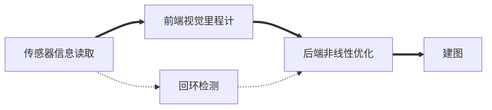

# 前言

​	学习SLAM，《视觉SLAM十四讲》第二版的部分内容及习题的相关笔记。

# 第1讲 预备知识

## 内容

​	SLAM是Simultaneous Localization and Mapping的缩写，即**同时定位与地图构建**。它是指搭载特定**传感器**的主体，在**没有环境先验信息**的情况下，于**运动过程中**建立**环境**的模型，同时估计自己的**运动**。

## 习题

1. 考虑增广矩阵$\bar{A}=[A|b]$，设$A$为$m\times n$矩阵，矩阵的秩是指列空间的维数。
   - 当$rank(A)<rank(\bar{A})$时，方程组无解，可用最小二乘法求近似解。
   - 当$rank(A)=rank(\bar{A})=n$时，方程组有唯一解，可以用高斯消元法等求解。
   - 当$rank(A)=rank(\bar{A})<n$时，方程组有无穷多解，用特解加$A$的零空间表示。
   
2. 高斯分布即正态分布。

   在一维情况下，随机变量$X$服从正态分布，记作$X\sim N(\mu,\sigma^2)$，其中$\mu$为期望值，$\sigma^2$为方差，概率密度函数为$f(x)=\frac{1}{\sqrt{2\pi \sigma^2} } e^{-\frac{(x-\mu)^2}{2\sigma^2} }$，当$\mu=0,\sigma=1$时，正态分布就成为**标准正态分布**：$f(x)=\frac{1}{\sqrt{2\pi}}e^{(-\frac{x^2}{2})}$。一维高斯分布如下图所示：

   

   python代码如下：

   ```python
   import numpy as np
   import matplotlib.pyplot as plt
   import math
   
   
   def dim1_gaussian_distribution(_x, _mu, _sigma):
       return np.exp(-1 * ((_x - _mu) ** 2) / (2 * _sigma ** 2)) / math.sqrt(2 * np.pi * _sigma ** 2)
   
   
   def dim1_gaussian_show(_mu=0, _sigma=1):
       x = np.linspace(_mu - 6 * _sigma, _mu + 6 * _sigma, 101)
       y = dim1_gaussian_distribution(x, _mu, _sigma)
       plt.plot(x, y)
       plt.grid()
       plt.show()
   
   
   if __name__ == '__main__':
       print("dim1_gaussian_distribution as main")
       dim1_gaussian_show()
   
   ```

   在二维情况下，概率密度函数为$f(x,y)=\frac{1}{2\pi \sigma_1 \sigma_2\sqrt{1-\rho ^2 } } e^{-\frac{1}{2(1-\rho^2)}(\frac{(x-\mu_1)^2}{\sigma_1^2} -\frac{2\rho(x-\mu_1)(y-\mu_2)}{\sigma_1\sigma_2} +\frac{(y-\mu_2)^2}{\sigma_2^2} ) }$ ，其中$\sigma_1>0,\sigma_2>0,-1<\rho<1$。二维高斯分布如下图所示：

   

   python代码如下：

   ```python
   from mpl_toolkits.mplot3d import Axes3D
   import numpy as np
   import matplotlib.pyplot as plt
   import math
   
   
   def dim2_gaussian_distribution(_x, _y, _mu1, _mu2, _sigma1, _sigma2, _rho):
       return np.exp((-1 / (2 * (1 - _rho ** 2))) *
                     (
                             (_x - _mu1) ** 2 / (_sigma1 ** 2) -
                             2 * _rho * (_x - _mu1) * (_y - _mu2) / (_sigma1 * _sigma2) +
                             (_y - _mu2) ** 2 / (_sigma2 ** 2)
                     )) / (2 * np.pi * _sigma1 * _sigma2 * math.sqrt(1 - _rho ** 2))
   
   
   def dim2_gaussian_show(_mu1=0, _mu2=0, _sigma1=1, _sigma2=1, _rho=0):
       fig = plt.figure()
       ax = Axes3D(fig)
   
       x = np.linspace(_mu1 - 6 * _sigma1, _mu1 + 6 * _sigma1, 1001)
       y = np.linspace(_mu2 - 6 * _sigma2, _mu2 + 6 * _sigma2, 1001)
   
       mesh_x, mesh_y = np.meshgrid(x, y)
       mesh_z = dim2_gaussian_distribution(mesh_x, mesh_y, _mu1, _mu2, _sigma1, _sigma2, _rho)
   
       plt.xlabel('x')
       plt.ylabel('y')
   
       ax.plot_surface(mesh_x, mesh_y, mesh_z)
       plt.show()
   
   
   if __name__ == '__main__':
       print("dim2_gaussian_distribution as main")
       dim2_gaussian_show()
   
   ```

   在多维情况下：
   $$
   N(x|\mu,\Sigma )=\frac{1}{(2\pi)^{D/2}} \frac{1}{\mid \Sigma \mid^{1/2} } e^{-\frac{1}{2} (x-\mu)^T\Sigma^{-1}(x-\mu)}
   $$
   其中$\Sigma$为协方差矩阵，协方差的公式为：
   $$
   cov(X,Y)=E(X\cdot Y)-E(X)E(Y)
   $$

3. STL即Standard Template Library，标准模板库，常用的vector就是一个模板。

4. VS。

5. 智能指针、lambda表达式等。到目前为止共有6个标准：C++98 C++11 C++14 C++17 C++20 C++23。

6. Ubuntu。

7. 目录结构：

   - /bin：二进制文件Binaries的缩写，存放最经常使用的命令。
   - /boot：启动的核心文件。
   - /dev：设备Device的缩写，存放外部设备。
   - /etc：等等Etcetera的缩写，存放配置文件。
   - /home：用户主目录。
   - /lib：系统最基本的动态链接共享库。
   - /opt：可选Optional的缩写，安装额外软件的目录。
   - /proc：进程Process的缩写。
   - /root：超级权限者用户主目录。
   - /run：临时文件系统，存储系统启动以来的信息，重启即清除。
   - /sbin：Superuser Binaries，超级权限者的系统管理程序。
   - /srv：存放一些服务启动之后需要提取的数据。
   - /sys：内核设备。
   - /tmp：临时Temporary的缩写，存放临时文件。
   - /usr：共享资源unix shared resources的缩写，类似windows的program files。
   - /var：变量variable的缩写，存放不断扩充、修改的东西，如日志。
   
   常用命令：
   
   |  命令  |                             含义                             |
   | :----: | :----------------------------------------------------------: |
   |  cat   |           concatenate，在标准输出上列出文件的内容            |
   |   cd   | change directory，切换当前工作目录，/表示根目录，~表示home，.表示当前目录，..表示上一级目录 |
   | chmod  |     change mode。所有者、用户组、其他用户；读、写、执行      |
   | chown  |                   change owner，更改所有者                   |
   |   cp   |                  copy file，复制文件或目录                   |
   |   df   |                 disk free，磁盘使用情况统计                  |
   |  diff  |                       逐行比较文件异同                       |
   |   du   |               disk usage，显示目录或文件的大小               |
   |  echo  |                     将一些数据移到文件中                     |
   |  find  |                      指定目录下查找文件                      |
   |  grep  |                  查找文件里符合条件的字符串                  |
   |  head  |                   查看文件的开头部分的内容                   |
   | locate |                      搜索文件并打印位置                      |
   |   ls   |        list files，列出当前工作目录包含的文件及子目录        |
   |  man   |                      查看某条命令的手册                      |
   | mkdir  |                   make directory，创建目录                   |
   |   mv   |              move file，对文件或目录移动或改名               |
   |  pwd   |       print work directory，打印当前工作目录的绝对路径       |
   |   rm   | remove，删除文件或目录，==无法恢复==。-i：删除前逐一询问确认；-f：即使是只读文档，也直接删除，无需确认；-r：递归删除目录。rm -rf * / rm -rf .删除当前目录。 |
   | rmdir  |                 remove directory，删除空目录                 |
   |  sudo  |                  SuperUser Do，超级用户权限                  |
   |  tail  |                   查看文件的末尾部分的内容                   |
   |  tar   |            tape archive，归档多个文件到一个压缩包            |
   | touch  | 修改文件或者目录的时间属性，包括存取时间和更改时间。若文件不存在，则新建文件 |
   
8. Ubuntu安装软件的三种方式：

   - apt-get：

     |            命令            |          含义           |
     | :------------------------: | :---------------------: |
     |       apt-get update       |   更新软件信息数据库    |
     |      apt-get upgrade       |      进行软件升级       |
     |    apt-get install xxx     |         安装xxx         |
     |     apt-get remove xxx     |         卸载xxx         |
     | apt-get --purge remove xxx | 卸载xxx，并删除配置文件 |

   - dpkg安装deb：

     |      命令       |            含义             |
     | :-------------: | :-------------------------: |
     | dpkg -i xxx.deb |           安装xxx           |
     |   dpkg -r xxx   |           卸载xxx           |
     |   dpkg -P xxx   | （卸载xxx），并删除配置文件 |
     |     dpkg -l     |     列出当前已安装的包      |

   - make install安装源码包：配置、编译、安装。

 	安装位置一般在/opt或/usr/bin下，具体可以通过which或whereis命令查找。which只能找到命令的位置，而whereis还可以找到命令的二进制文件，源文件和手动页文件。

​	只知道模糊的软件名称可以用apt search查找。

9. vim操作总结（文中“nu”代表阿拉伯数字）：

   **NORMAL模式：**

   |               Vim中的操作符               |                             含义                             |
   | :---------------------------------------: | :----------------------------------------------------------: |
   |                    ESC                    |                      放弃正在输入的操作                      |
   |                  h j k l                  |                         左 下 上 右                          |
   |                     x                     |                    删除光标所在位置的字符                    |
   |                     i                     |                    插入到光标所在位置之前                    |
   |                     I                     |                插入到本行第一个非空格字符之前                |
   |                     A                     |               插入到本行最后一个非空格字符之后               |
   |                     o                     |                    在下一行新加一行并插入                    |
   |                     O                     |                    在上一行新加一行并插入                    |
   |                     u                     |                   删除上一次的改动（undo）                   |
   |                     U                     |                       删除一整行的改动                       |
   |                     p                     |      将最后一次删除的内容置入光标之后或下一行（针对dd）      |
   |                     y                     |               复制，亦可做操作符，比如yw / ye                |
   |                     r                     |                    替换光标所在位置的字符                    |
   |                     R                     |       连续替换多个字符，每插入一个字符删除一个已有字符       |
   |                 w / nu-w                  |            光标向前移动1 / N个单词（移动到词头）             |
   |                 e / nu-e                  | 光标向前移动1 / N个单词（移动到词尾）（如果当前光标不在词尾，本词也算一个） |
   |              $ / nu-&dollar;              |        光标向前移动1 / N行（移动到行尾）（本行也算）         |
   |                     0                     |                         移动光标到行                         |
   |                    gg                     |                       跳转到文件第一行                       |
   |                 G / nu-G                  |               跳转到文章最后一行 / 跳转到第N行               |
   |                / or ?-str                 |                      正或逆向查找字符串                      |
   |                   n / N                   |             顺或逆着当前方向查找，查尽后从头开始             |
   |                     %                     |                      查找配对括号()[]{}                      |
   |                     v                     | 可视模式，选中内容进行后续操作，输入d删除，输入:+w+str存入文件 |
   |                dw / d-nu-w                | 从当前光标位置开始（包括删除光标所在字符）删除一个单词，删除后光标停留在未删除的第一的字符上（英文会删除空格，中文删到出现英文字符或符号或数字或和英文遇到第一个空格删掉而结束） |
   |                de / d-nu-e                |              比dw少删一个空格，删完光标在空格处              |
   |            d$ / d-nu-&dollar;             | 从当前光标删除到行末（包括当前字符，删除后光标在当前位置的前一个字符） |
   |                dd / nu-dd                 |              从当前行开始删除1 / N行（含本行）               |
   | dw / de / d$ / dd(add nu)八个命令中d换成c |           变删除为更改，即在删除之后进入INSERT模式           |
   |                  Ctrl-r                   |                             redo                             |
   |                  Ctrl-g                   |     显示当前编辑文件中当前光标所在行位置以及文件状态信息     |
   |                  Ctrl-o                   |                        回到之前的位置                        |
   |                  Ctrl-i                   |                        去往较新的位置                        |
   |                  Ctrl-w                   |                           切换窗口                           |

   **COMMAND LINE模式：**

   |        Vim中的操作符        |                             含义                             |
   | :-------------------------: | :----------------------------------------------------------: |
   |             ESC             |                      放弃正在输入的命令                      |
   |         :+w(write)          |                             保存                             |
   |           :+w+str           |                      以字符串为名称保存                      |
   |          :+q(quit)          |                             退出                             |
   |            :+q!             |                        强制退出并保存                        |
   |            :+wq             |                          保存并退出                          |
   |          :+x(=wq)           |                          保存并退出                          |
   |         :+s/old/new         |                 改变光标所在行的第一个匹配项                 |
   |        :+s/old/new/g        |                           全行改变                           |
   |      :+#,#s/old/new/g       |                   两个行号之间的匹配项改变                   |
   |       :+%s/old/new/g        |                           全文改变                           |
   |       :+%s/old/new/gc       |                全文改变并对每个匹配项单独提示                |
   |             :+!             |  外部shell命令，例如Linux下:!ls,:!rm和Windows下:!dir,:!del   |
   |           :+r+str           | 导入文件内容，:+r+!dir可以导入目录（均为插入到当前光标之后） |
   | :+set+hlsearch / nohlsearch |                         设置搜索高亮                         |
   |      :help(+something)      |                      帮助文档或指令说明                      |
   |      :edit $VIM/_vimrc      |                          编辑vimrc                           |
   |           Ctrl-d            |                         显示命令列表                         |
   |             TAB             |                           命令补全                           |

   **INSERT模式：**

   | Vim中的操作符 |      含义      |
   | :-----------: | :------------: |
   |      ESC      | 回到NORMAL模式 |


# 第2讲 认识SLAM

## 内容

​	经典视觉SLAM框架：



​	**视觉里程计：**Visual Odometry,VO。视觉里程计任务是估算相邻图像间相机的运动，以及局部地图的样子。VO又称为前端（Front End）。和计算机视觉联系紧密，如图像的特征提取和匹配。视觉里程计关心**相邻图像**之间的相机运动，和再往前的过去的信息没有关联，会不可避免地出现**累计漂移**。需要两种技术来校正这种漂移：后端优化和回环检测。

​	**后端优化：**Optimization。后端接受不同时刻视觉里程计测量的相机位姿，以及回环检测的信息，对它们进行优化，得到全局一致的轨迹和地图。由于接在VO之后，又称为后端（Back End）。主要指处理SLAM过程中噪声的问题。

​	**回环检测：**Loop Closure Detection。回环检测判断机器人是否到达过先前的位置。如果检测到回环,它会把信息提供给后端进行处理。负责检测机器人回到原始位置的事件。

​	**建图：**Mapping。它根据估计的轨迹,建立与任务要求对应的地图。分为度量地图（Metric Map）和拓扑地图（Topological Map）。

​	SLAM问题是一个**状态估计问题**，已知运动测量的读数和传感器的读数（这两者都有噪声），求解定位问题和建图问题。按照运动和观测方程是否为线性,噪声是否服从高斯分布进行分类，分为**线性/非线性**和**高斯/非高斯**系统。线性高斯系统的无偏的最优估计可以由卡尔曼滤波器给出，非线性非高斯系统中采用扩展卡尔曼滤波器和非线性优化两大类方法。视觉SLAM发展历程：扩展卡尔曼滤波器->粒子滤波器等其他滤波器->以图优化为代表的优化技术。现在优化技术已经明显优于滤波器技术，只要计算资源允许，通常选择优化方法。

## 习题

1. 文献下载工具推荐：sci-hub。
   - 文献[1]：基于单目视觉的同时定位与地图构建方法综述。
   - 文献[14]：基于图优化的同时定位与地图创建综述。
2. 文献翻译工具推荐：copytranslator。
   - 文献[9]：Past, Present, and Future of Simultaneous Localization and Mapping: Toward the Robust-Perception Age。
   - 文献[15]：Visual simultaneous localization and mapping: a survey。
   - 文献[16]：Topological simultaneous localization and mapping: a survey。
   - 文献[17]：Kalman Filter for Robot Vision: A Survey。
   - 文献[18]：Recent advances in simultaneous localization and map-building using computer vision。
3. g++ name.cpp -o newname。
4. OK。
5. OK。
6. OK。
7. CMake Practice.pdf，广为流传，可以随时在网上找到。
8. TODO，参考CMake Practice.pdf可完成。
9. OK。
10. 使用Clion。
11. 使用Clion。

# 第3讲 三维空间刚体运动

## 内容

### 3.1 旋转矩阵

#### 3.1.1 点和向量，坐标系

​	给定线性空间的一组基$(e_1,e_2,e_3)$，那么任意向量$a$在这组基下就有一个坐标：
$$
a=
\begin{bmatrix}
e_1, & e_2, & e_3
\end{bmatrix}
\begin{bmatrix}
a_1\\
a_2\\
a_3\end{bmatrix}=a_1e_1+a_2e_2+a_3e_3
$$
​	向量点积：$a\cdot b=a^{\top}b$。

​	向量叉积：定义为$a^{\wedge}b$，$a^{\wedge}$是一个反对称矩阵。
$$
a\times b=
\begin{vmatrix}
e_1& e_2& e_3\\
a_1& a_2& a_3\\
b_1& b_2& b_3
\end{vmatrix}=
\begin{bmatrix}
a_2b_3-a_3b_2 \\
a_3b_1-a_1b_3\\
a_1b_2-a_2b_1
 \end{bmatrix}=
\begin{bmatrix}
 0& -a_3& a_2\\
 a_3&  0& -a_1\\
 -a_2& a_1& 0
\end{bmatrix}b=a^{\wedge}b
$$

#### 3.1.2 坐标系间的欧式变换

​	欧式变换由旋转和平移组成。

​	同一个向量在不同单位正交基下的表示：
$$
\begin{bmatrix}
e_1, & e_2, & e_3
\end{bmatrix}
\begin{bmatrix}
a_1\\
a_2\\
a_3\end{bmatrix}=
\begin{bmatrix}
e_1', & e_2', & e_3'
\end{bmatrix}
\begin{bmatrix}
a_1'\\
a_2'\\
a_3'\end{bmatrix}
$$
​	等式左右同时左乘$\begin{bmatrix}e_1^{\top}\\e_2^{\top}\\e_3^{\top}\end{bmatrix}$得：
$$
\begin{bmatrix}
a_1\\
a_2\\
a_3\end{bmatrix}=
\begin{bmatrix}
e_1^{\top}e_1' & e_1^{\top}e_2' & e_1^{\top}e_3'\\
e_2^{\top}e_1' & e_2^{\top}e_2' & e_2^{\top}e_3'\\
e_3^{\top}e_1' & e_3^{\top}e_2' & e_3^{\top}e_3'\end{bmatrix}
\begin{bmatrix}
a_1'\\
a_2'\\
a_3'\end{bmatrix}=Ra'
$$
​	矩阵$R$描述了旋转本身，因此它被称为**旋转矩阵**。同时，该矩阵各分量是两个坐标系基的内积，由于基向量的长度为1，所以实际上是各基向量夹角的余弦值，所以这个矩阵也叫**方向余弦矩阵**。

​	旋转矩阵是一个行列式为1的**正交矩阵**。正交矩阵即逆为自身转置的矩阵，具有单位正交列向量，行列式等于+1或-1。

​	$n$维旋转矩阵的集合定义如下：
$$
SO(n)=\{R\in\mathbb{R}^{n\times n}\mid RR^{\top}=I,det(R)=1\}
$$
​	$SO(n)$是特殊正交群（Special Orthogonal Group），$SO(3)$就是指三维空间的旋转。$R^{-1}=R^{\top}$表示一个反向的变换。

#### 3.1.3 变换矩阵与齐次坐标

​	三维向量末尾添加1变成四维向量，称为**齐次坐标**。
$$
\begin{bmatrix}
a'\\
1\end{bmatrix}=
\begin{bmatrix}
R & t\\
0^{\top} & 1\end{bmatrix}
\begin{bmatrix}
a\\
1\end{bmatrix}=
T\begin{bmatrix}
a\\
1\end{bmatrix}
$$
​	矩阵$T$称为**变换矩阵**。$SE(n)$是特殊欧式群（Special Euclidean Group）。
$$
SE(3)=\left \{ T=\begin{bmatrix}
R & t\\
0^{\top} & 1\end{bmatrix}\in \mathbb{R}^{4\times 4}\mid R\in SO(3),t\in \mathbb{R}^3 \right \} 
$$
​	该矩阵的逆表示一个反向的变换：
$$
T^{-1}=\begin{bmatrix}
R^{\top} & -R^{\top}t\\
0^{\top} & 1\end{bmatrix}
$$

### 3.2 实践：Eigen

[Eigen官网教程](http://eigen.tuxfamily.org/dox-devel/modules.html)

### 3.3 旋转向量和欧拉角

#### 3.3.1 旋转向量

​	任意旋转都可以用**一个旋转轴**和**一个旋转角**来刻画。因此可以用一个向量表示，其方向与旋转轴一致，而长度等于旋转角，这种向量称为**旋转向量**（或轴角/角轴，Axis-Angle）。假设旋转轴为一个单位长度的向量$n$，角度为$\theta$，那么向量$\theta n$也可以描述这个旋转。从旋转向量到旋转矩阵的转换过程由**罗德里格斯公式**表明：
$$
R=cos\theta I+(1-cos\theta)nn^{\top}+sin\theta n^{\wedge}
$$
​	符号^是向量到反对称矩阵的转换符，见3.1.1节。反之，我们也可以计算从一个旋转矩阵到旋转向量的转换，对于转角$\theta$，取两边的迹（矩阵对角线元素之和）：
$$
\begin{eqnarray}
tr(R) & = & cos\theta \space tr(I)+(1-cos\theta )tr(nn^{\top})+sin\theta \space tr(n^{\wedge})\\
& = & 3cos\theta+(1-cos\theta )\\
& = & 1+2cos\theta
\end{eqnarray}
$$
​	因此：$\theta =\arccos \frac{tr(R)-1}{2}$。、

​	对于转轴$n$，旋转轴上的向量在旋转后不发生改变，说明：$Rn=n$。

​	因此转轴$n$是矩阵$R$特征值1对应的特征向量。

#### 3.3.2 欧拉角

​	使用三个分离的转角，把一个旋转分解成三次绕不同轴的旋转。欧拉角的一个重大缺点是会碰到著名的万向锁问题。用三个实数表达三维旋转都会不可避免地碰到奇异性问题。欧拉角不适用于插值和迭代，往往只用于人机交互中。

### 3.4 四元数

#### 3.4.1 四元数的定义

​	复数：用复数集$\mathbb{C}$表示复平面上的向量，而复数的乘法则能表示复平面上的旋转。例如，乘上复数$i$相当于逆时针把一个复向量旋转90度。

​	类似的，在表达三维空间旋转时，也有一种类似于复数的代数：**四元数**。四元数是一种扩展的复数，既是紧凑的，也没有奇异性。

​	想要将复平面的向量旋转$\theta$角时，可以给这个复向量乘以$e^{i\theta}$，$e^{i\theta}=cos\theta+i\space sin\theta$（欧拉公式），这是一个单位长度的复数，所以在二维情况下旋转可以用**单位复数**来描述。类似地，三维旋转可以由**单位四元数**来描述，单位四元数模长为1。

​	一个四元数$q$拥有一个实部和三个虚部。
$$
q=q_0+q_1i+q_2j+q_3k
$$
​	其中，$i,j,k$为四元数的三个虚部，这三个虚部满足以下关系式：
$$
\left\{\begin{array}{l}
i^{2}=j^{2}=k^{2}=-1 \\
i j=k, j i=-k \\
j k=i, k j=-i \\
k i=j, i k=-j
\end{array}\right.
$$
​	也可以用一个标量和一个向量来表达四元数：
$$
q=[s,v]^{\top},s=q_0\in\mathbb{R},v=[q_1,q_2,a_3]^{\top}\in\mathbb{R}^3
$$
​	这里$s$称为四元数的实部，而$v$称为它的虚部。如果一个四元数的虚部为0，则称为实四元数，如果一个四元数的实部为0，则称为虚四元数。

​	在四元数中，乘以$i$代表绕$i$轴旋转180度。

#### 3.4.2 四元数的运算

1. 加法和减法
   $$
   \boldsymbol q_a\pm \boldsymbol q_b=[s_a\pm s_b,\boldsymbol v_a\pm \boldsymbol v_b]^{\top}
   $$

2. 乘法

   四元数的乘法是各项分别相乘再求和。
   $$
   \begin{aligned}
   \boldsymbol{q}_{a} \boldsymbol{q}_{b}=& s_{a} s_{b}-x_{a} x_{b}-y_{a} y_{b}-z_{a} z_{b} \\
   &+\left(s_{a} x_{b}+x_{a} s_{b}+y_{a} z_{b}-z_{a} y_{b}\right) i \\
   &+\left(s_{a} y_{b}-x_{a} z_{b}+y_{a} s_{b}+z_{a} x_{b}\right) j \\
   &+\left(s_{a} z_{b}+x_{a} y_{b}-y_{b} x_{a}+z_{a} s_{b}\right) k
   \end{aligned}
   $$
   写成向量形式：
   $$
   \boldsymbol{q}_{a} \boldsymbol{q}_{b}=\left[s_{a} s_{b}-\boldsymbol{v}_{a}^{T} \boldsymbol{v}_{b}, s_{a} \boldsymbol{v}_{b}+s_{b} \boldsymbol{v}_{a}+\boldsymbol{v}_{a} \times \boldsymbol{v}_{b}\right]
   $$

3. 模长
   $$
   \left\|\boldsymbol{q}_{a}\right\|=\sqrt{s_{a}^{2}+x_{a}^{2}+y_{a}^{2}+z_{a}^{2}}
   $$

   $$
   \left\|\boldsymbol{q}_{a}\boldsymbol{q}_{b}\right\|=\left\|\boldsymbol{q}_{a}\right\|\left\|\boldsymbol{q}_{b}\right\|
   $$

4. 共轭
   $$
   \boldsymbol q_a^*=[s_a,-\boldsymbol v_a]
   $$

   $$
   \boldsymbol q^*\boldsymbol q=\boldsymbol q\boldsymbol q*=[s_a^2+\boldsymbol v^{\top}\boldsymbol v,0]=[\left\|\boldsymbol q\right\|^2,0]
   $$

5. 逆
   $$
   \boldsymbol q^{-1}=\boldsymbol q^*/\left\|\boldsymbol q\right\|^2
   $$

   $$
   \boldsymbol q\boldsymbol q^{-1}=\boldsymbol q^{-1}\boldsymbol q=1
   $$

   $$
   (\boldsymbol q_a \boldsymbol q_b)^{-1}=\boldsymbol q_b^{-1}\boldsymbol q_a^{-1}
   $$

6. 数乘
   $$
   k\boldsymbol q=[ks,k\boldsymbol v]
   $$

#### 3.4.3 用四元数表示旋转

​	一个单位四元数$q$指定的旋转：
$$
p'=qpq^{-1}
$$
​	$p$和$p'$都是三维空间点的虚四元数表示。

#### 3.4.4 四元数到其他旋转表示的变换

​	四元数乘法也可以写成一种矩阵的乘法，设$q=[s,v]^{\top}$，定义如下的符号$+$和$\oplus$为：
$$
q^+=\begin{bmatrix}
s & -v^{\top}\\
v & sI+v^{\wedge}\end{bmatrix},\space
q^{\oplus}=\begin{bmatrix}
s & -v^{\top}\\
v & sI-v^{\wedge}\end{bmatrix}
$$

$$
q_1q_2=q_1^+q_2=q_2^{\oplus}q_1
$$

$$
p'=qpq^{-1}=q^+p^+q^{-1}=q^+{q^{-1}}^{\oplus}p
$$

​	得到四元数到旋转矩阵的转换：
$$
R=vv^{\top}+s^2I+2sv^{\wedge}+(v^{\wedge})^2
$$
​	对该式两边求迹解出：$\theta=2\arccos s$，将$q$的虚部代入$p$得出$q$的虚部组成的向量在旋转时保持不变，即为旋转轴，得到四元数到旋转向量的转换：
$$
\left \{ \begin{array}{l}
\theta =2\arccos q_0\\
[n_x,n_y,n_z]^{\top}=[q_1,q_2,q_3]^{\top}/\sin \frac{\theta }{2} 
\end{array} \right.
$$

### 3.5 相似、仿射、射影变换

​	除欧氏变换外三维空间还存在其他几种变换方式，欧氏变换$\subset $相似变换$\subset $仿射变换$\subset $射影变换。

1. 相似变换

   ​	相似变换比欧氏变换多了一个自由度，它允许物体进行均匀缩放，矩阵表示为：
   $$
   T_S=\begin{bmatrix}
   sR & t\\
   0^{\top} & 1\end{bmatrix}
   $$
   ​	旋转部分多了一个缩放因子$s$，三维相似变换的集合也叫做**相似变换群**，记作$Sim(3)$。

2. 仿射变换

   ​	仿射变换的矩阵形式如下：
   $$
   T_A=\begin{bmatrix}
   A& t\\
   0^{\top} & 1\end{bmatrix}
   $$
   ​	仿射变换仅要求$A$是一个可逆矩阵，立方体经过仿射变换变成平行六面体。

3. 射影变换

   ​	射影变换是最一般的变换，它的矩阵形式为：
   $$
   T_P=\begin{bmatrix}
   A& t\\
   a^{\top} & 1\end{bmatrix}
   $$
   ​	$A$为可逆矩阵，$t$为平移，$a^{\top}$为缩放。

   ​	常见变换的性质比较（三维）：

   | 变换名称 |                      矩阵形式                      | 自由度 |       不变性质       |
   | :------: | :------------------------------------------------: | :----: | :------------------: |
   | 欧氏变换 | $\begin{bmatrix}R & t\\0^{\top} & 1\end{bmatrix}$  |   6    |   长度、夹角、体积   |
   | 相似变换 | $\begin{bmatrix}sR & t\\0^{\top} & 1\end{bmatrix}$ |   7    |         形状         |
   | 仿射变换 | $\begin{bmatrix}A & t\\0^{\top} & 1\end{bmatrix}$  |   12   |    平行性、体积比    |
   | 射影变换 | $\begin{bmatrix}A & t\\a^{\top} & 1\end{bmatrix}$  |   15   | 接触平面的相交和相切 |

### 3.6 实践：Eigen几何模块

#### 3.6.1 Eigen几何模块的数据演示

[Eigen几何模块](https://eigen.tuxfamily.org/dox-devel/group__TutorialGeometry.html)

#### 3.6.2 实际的坐标变换例子

### 3.7 可视化演示

#### 3.7.1 显示运动轨迹

#### 3.7.2 显示相机的位姿

## 习题

1. 验证如下：
   $$
   \begin{bmatrix}
   e_1, & e_2, & e_3
   \end{bmatrix}
   \begin{bmatrix}
   a_1\\
   a_2\\
   a_3\end{bmatrix}=
   \begin{bmatrix}
   e_1', & e_2', & e_3'
   \end{bmatrix}
   \begin{bmatrix}
   a_1'\\
   a_2'\\
   a_3'\end{bmatrix}
   $$
   等式左右同时左乘$\begin{bmatrix}e_1^{\top}\\e_2^{\top}\\e_3^{\top}\end{bmatrix}$算出
   $$
   R=\begin{bmatrix}
   e_1^{\top}e_1' & e_1^{\top}e_2' & e_1^{\top}e_3'\\
   e_2^{\top}e_1' & e_2^{\top}e_2' & e_2^{\top}e_3'\\
   e_3^{\top}e_1' & e_3^{\top}e_2' & e_3^{\top}e_3'\end{bmatrix}
   $$
   等式左右同时左乘$\begin{bmatrix}e_1'^{\top}\\e_2'^{\top}\\e_3'^{\top}\end{bmatrix}$算出
   $$
   R^{-1}=\begin{bmatrix}
   e_1'^{\top}e_1 & e_1'^{\top}e_2 & e_1'^{\top}e_3\\
   e_2'^{\top}e_1 & e_2'^{\top}e_2 & e_2'^{\top}e_3\\
   e_3'^{\top}e_1 & e_3'^{\top}e_2 & e_3'^{\top}e_3\end{bmatrix}
   $$
   $R^{\top}=R^{-1}$，故$R$为正交矩阵。

2. 推导并不复杂，利用旋转前的向量、旋转轴和旋转角表示出旋转后的向量也就得到了旋转矩阵。具体参考[维基百科：罗德里格斯公式](https://en.wikipedia.org/wiki/Rodrigues'_rotation_formula)。

3. $p'=qpq^{-1}=q^+{q^{-1}}^{\oplus}p=q^+{q^*}^{\oplus}p/\left \| q \right \| $，由于$p$是虚四元数，所以$p'$是虚四元数就等价于矩阵$q^+{q^*}^{\oplus}$的右上角分块（第1行的2～4列）为$0^{\top}$，代入计算后得到这部分为$sv^{\top}-v^{\top}(sI+v^{\wedge})=-v^{\top}v^{\wedge}=0^{\top}$，所以$p'$是虚四元数。

4. 总结这四者间的转换关系图如下：

   ```mermaid
   graph LR
   A(旋转矩阵)
   B(轴角)
   C(欧拉角) 
   D(四元数)
   C-->|绕坐标轴的旋转矩阵的连乘|A-->|转角可由罗德里格斯公式取等式两边的迹得出,转轴是旋转矩阵特征值1对应的特征向量|B-->|式3_44的逆变换|D
   D-->|式3_44|B-->|罗德里格斯公式|A-->|一般情况由定义消元,常见类型的欧拉角容易查到公式|C
   A-->|较复杂,不展开|D
   D-->|式3_39|A
   ```

5. 实现代码如下：

   ```cpp
   #include <iostream>
   #include <Eigen/Core>
   
   using namespace std;
   using namespace Eigen;
   #define MATRIX_SIZE 9
   
   int main(int argc, char **argv) {
       Matrix<double, MATRIX_SIZE, MATRIX_SIZE> matrix_NN = MatrixXd::Random(MATRIX_SIZE, MATRIX_SIZE);
       cout << "Origin Matrix:\n" << matrix_NN << endl;
       Matrix3d Matrix_33 = matrix_NN.block<3, 3>(0, 0);
       cout << "3x3 SubMatrix:\n" << Matrix_33 << endl;
       matrix_NN.block<3, 3>(0, 0) = Matrix3d::Identity();
       cout << "Modified Matrix:\n" << matrix_NN << endl;
       return 0;
   }
   
   ```

6. 方法参见[Eigen矩阵分解](https://eigen.tuxfamily.org/dox-devel/group__TutorialLinearAlgebra.html)，主要有直接求逆、LU分解、QR分解、LLT分解、LDLT分解等，实现代码如下：

   ```cpp
   #include <iostream>
   #include <ctime>
   #include <Eigen/Core>
   #include <Eigen/Dense>
   
   using namespace std;
   using namespace Eigen;
   #define MATRIX_SIZE 10
   
   int main(int argc, char **argv) {
       clock_t time_stt;
       Matrix<double, MATRIX_SIZE, 1> x;
   
       Matrix<double, MATRIX_SIZE, MATRIX_SIZE> A = MatrixXd::Random(MATRIX_SIZE, MATRIX_SIZE);
       A = A * A.transpose();
       cout << "Matrix A:\n" << A << endl;
       Matrix<double, MATRIX_SIZE, 1> b = MatrixXd::Random(MATRIX_SIZE, 1);
       cout << "Vector b:\n" << b.transpose() << endl << endl << endl;
   
       time_stt = clock();
       x = A.inverse() * b;
       cout << "time of normal inverse is " << 1000 * (clock() - time_stt) / (double) CLOCKS_PER_SEC << "ms" << endl;
       cout << "x = " << x.transpose() << endl;
   
       time_stt = clock();
       x = A.partialPivLu().solve(b);
       cout << "time of PartialPivLU is " << 1000 * (clock() - time_stt) / (double) CLOCKS_PER_SEC << "ms" << endl;
       cout << "x = " << x.transpose() << endl;
   
       time_stt = clock();
       x = A.fullPivLu().solve(b);
       cout << "time of FullPivLU is " << 1000 * (clock() - time_stt) / (double) CLOCKS_PER_SEC << "ms" << endl;
       cout << "x = " << x.transpose() << endl;
   
       time_stt = clock();
       x = A.householderQr().solve(b);
       cout << "time of HouseholderQR is " << 1000 * (clock() - time_stt) / (double) CLOCKS_PER_SEC << "ms" << endl;
       cout << "x = " << x.transpose() << endl;
   
       time_stt = clock();
       x = A.colPivHouseholderQr().solve(b);
       cout << "time of ColPivHouseholderQR is " << 1000 * (clock() - time_stt) / (double) CLOCKS_PER_SEC << "ms" << endl;
       cout << "x = " << x.transpose() << endl;
   
       time_stt = clock();
       x = A.fullPivHouseholderQr().solve(b);
       cout << "time of FullPivHouseholderQR is " << 1000 * (clock() - time_stt) / (double) CLOCKS_PER_SEC << "ms" << endl;
       cout << "x = " << x.transpose() << endl;
   
       time_stt = clock();
       x = A.completeOrthogonalDecomposition().solve(b);
       cout << "time of CompleteOrthogonalDecomposition is " << 1000 * (clock() - time_stt) / (double) CLOCKS_PER_SEC
            << "ms" << endl;
       cout << "x = " << x.transpose() << endl;
   
       time_stt = clock();
       x = A.llt().solve(b);
       cout << "time of llt is " << 1000 * (clock() - time_stt) / (double) CLOCKS_PER_SEC << "ms" << endl;
       cout << "x = " << x.transpose() << endl;
   
       time_stt = clock();
       x = A.ldlt().solve(b);
       cout << "time of ldlt is " << 1000 * (clock() - time_stt) / (double) CLOCKS_PER_SEC << "ms" << endl;
       cout << "x = " << x.transpose() << endl;
   
       return 0;
   }
   
   ```

 # 第4讲 李群与李代数基础

## 内容

### 4.1 李群李代数基础

​	像特殊正交群和特殊欧氏群这种只有一个（良好的）运算的集合称为群。

​	李群李代数的创始人：挪威数学家索菲斯·李(Sophus Lie)。

#### 4.1.1 群

​	群是一种集合加上一种运算的代数结构。把集合记作$A$，运算记作$\cdot$，那么群可以记作$G=(A,\cdot)$。群要求这个运算满足以下几个条件：

1. 封闭性：$\forall a_1,a_2\in A,a_1\cdot a_2\in A$.
2. 结合律：$\forall a_1,a_2,a_3\in A,(a_1\cdot a_2)\cdot a_3=a_1\cdot (a_2\cdot a_3)$.
3. 幺元：$\exists a_0\in A,\space s.t.\space \forall a\in A,a_0\cdot a=a\cdot a_0=a$.
4. 逆：$\forall a\in A,\exists a^{-1}\in A,\space s.t.\space  a\cdot a^{-1}=a_0$.

​	李群是指具有连续（光滑）性质的群。$SO(n)$和$SE(n)$都是李群，每个李群都有对应的李代数，例如$SO(3)$对应李代数$\mathfrak{so} (3)$。

#### 4.1.2 李代数的引出

​	在$t=0$附近，旋转矩阵可以由$R(t)=exp(\phi_0^{\wedge}t)$计算。而$\dot{R} (t)R(t)^{\top}=\phi(t)^{\wedge}$。

#### 4.1.3 李代数的定义

​	每个李群都有与之对应的李代数。李代数描述了李群的局部性质。李代数的定义如下：

​	李代数由一个集合$\mathbb{V}$，一个数域$\mathbb{F}$和一个二元运算$[,]$组成。如果它们满足以下几条性质，则称$(\mathbb{V},\mathbb{F},[,])$为一个李代数，记作$\mathfrak{g}$。

1. 封闭性：$\forall X,Y\in \mathbb{V},[X,Y]\in \mathbb{V}$.

2. 双线性：$\forall X,Y,Z\in \mathbb{V},\space a,b\in \mathbb{F}:$

   $[aX+bY,Z]=a[X,Z]+b[Y,Z],\space [Z,aX+bY]=a[Z,X]+b[Z,Y]$.

3. 自反性：$\forall X,Y\in \mathbb{V},[X,X]=0$.

4. 雅可比等价：$\forall X,Y,Z\in \mathbb{V},[X,[Y,Z]]+[Z,[X,Y]]+[Y,[Z,X]]=0$.

​	其中二元运算被称为**李括号**。例如三维向量上定义的叉积是一种李括号，$\mathfrak{g}=(\mathbb{R}^3,\mathbb{R},\times)$构成了一个李代数。

#### 4.1.4 李代数$\mathfrak{so}(3)$

​	$SO(3)$对应的李代数是定义在$\mathbb{R}^3$上的向量，记作$\phi$。每个$\phi$都可以生成一个反对称矩阵：
$$
\Phi=\phi^{\wedge}=
\begin{bmatrix}
0 & -\phi_3 & \phi_2\\
\phi_3 & 0 & -\phi_1\\
-\phi_2 & \phi_1 & 0\end{bmatrix}
\in\mathbb{R}^{3\times 3}
$$
​	两个向量$\phi_1,\phi_2$的李括号为：$[\phi_1,\phi_2]=(\Phi_1\Phi_2-\Phi_2\Phi_1)^{\vee}$。

​	由于三维向量与反对称矩阵一一对应，可以说$\mathfrak{so}(3)$的元素是三维向量或者三维反对称矩阵：
$$
\mathfrak{so}(3)=\{\phi\in \mathbb{R}^3,\Phi=\phi^{\wedge}\in \mathbb{R}^{3\times 3}\}
$$
​	它与$SO(3)$的关系由指数映射给定：
$$
R=exp(\phi^{\wedge})
$$

#### 4.1.5 李代数$\mathfrak{se}(3)$

​	$\mathfrak{se}(3)$位于$\mathbb{R}^6$空间中：
$$
\mathfrak{se}(3)=\left\{
\xi=\begin{bmatrix}\rho\\\phi\end{bmatrix}\in\mathbb{R}^6,
\rho\in\mathbb{R}^3,
\phi\in\mathfrak{so}(3),
\xi^{\wedge}=
\begin{bmatrix}\phi^{\wedge}&\rho\\0^{\top}&0\end{bmatrix}\in\mathbb{R}^{4\times4}
\right\}
$$
​	把每个$\mathfrak{se}(3)$元素记作$\xi$，它是一个六维向量。前三维为平移（不同于变换矩阵中的平移），记作$\rho$；后三维为旋转，记作$\phi$，是$\mathfrak{so}(3)$元素。

​	李代数$\mathfrak{se}(3)$也有类似于$\mathfrak{so}(3)$的李括号：$[\xi_1,\xi_2]=(\xi_1^{\wedge}\xi_2^{\wedge}-\xi_2^{\wedge}\xi_1^{\wedge})^{\vee}$。

### 4.2 指数与对数映射

#### 4.2.1 $SO(3)$上的指数映射

​	任意矩阵的指数映射可以写成一个泰勒展开，其结果仍是一个矩阵：
$$
exp(A)=\sum_{n=0}^{\infty}\frac{1}{n!}A^n
$$
​	同样地，对$\mathfrak{so}(3)$中任意一元素$\phi$，同样用这种方式定义它的指数映射：
$$
exp(\phi^{\wedge})=\sum_{n=0}^{\infty}\frac{1}{n!}(\phi^{\wedge})^n
$$
​	定义$\phi$的模长和方向分别为$\theta$和$a$，即$\phi=\theta a$。其中$\left \| a \right \| =1$。

​	容易算出$a^{\wedge}a^{\wedge}=aa^{\top}-I$和$a^{\wedge}a^{\wedge}a^{\wedge}=-a^{\wedge}$。这两个式子提供了处理$a^{\wedge}$高阶项的方法。
$$
exp(\phi^{\wedge})=exp(\theta a^{\wedge})=\sum_{n=0}^{\infty}\frac{1}{n!}(\theta a^{\wedge})^n
$$
​	化简该式可以得到：
$$
exp(\theta a^{\wedge})=cos\theta I+(1-cos\theta)aa^{\top}+sin\theta a^{\wedge}
$$
​	结果和罗德里格斯公式形式完全一致。这说明$\mathfrak{so}(3)$就是**旋转向量**组成的空间。通过指数映射，将$\mathfrak{so}(3)$中的任意一个向量对应到了一个位于$SO(3)$中的旋转矩阵。同样通过对数映射也可以把$SO(3)$中的元素对应到$\mathfrak{so}(3)$中：
$$
\phi=ln(R)^{\vee}=(\sum_{n=0}^{\infty}\frac{(-1)^n}{n+1}(R-I)^{n+1})^{\vee}
$$
​	每个$SO(3)$中的元素，都可以找到多个$\mathfrak{so}(3)$元素与之对应，如果旋转角度固定在$\pm \pi$之间，那么李群和李代数的元素是一一对应的。

#### 4.2.2 $SE(3)$上的指数映射

​	$\mathfrak{se}(3)$上的指数映射形式如下：
$$
exp(\xi^{\wedge})=
\begin{bmatrix}
\sum_{n=0}^{\infty}\frac{1}{n!}(\phi^{\wedge})^n&\sum_{n=0}^{\infty}\frac{1}{(n+1)!}(\phi^{\wedge})^n\rho\\
0^{\top}&1\end{bmatrix}=
\begin{bmatrix}R&J\rho\\0^{\top}&1\end{bmatrix}=T
$$
​	其中：
$$
J=\frac{\sin\theta}{\theta}I+(1-\frac{\sin\theta}{\theta})aa^{\top}+\frac{1-\cos\theta}{\theta}a^{\wedge}
$$
​	总结$SO(3),\mathfrak{so}(3)$和$SE(3),\mathfrak{se}(3)$之间的关系如下：

-so(3)&SE(3)-se(3).png)

### 4.3 李代数求导与扰动模型

#### 4.3.1 BCH公式与近似形式

​	两个李代数指数映射乘积的完整形式，由Baker-Campbell-Hausdorff公式（BCH公式）。给出它展开式的前几项：
$$
ln(exp(A)exp(B))=A+B+\frac{1}{2}[A,B]+\frac{1}{12}[A,[A,B]]-\frac{1}{12}[B,[A,B]]+\cdots
$$
​	其中$[,]$为李括号。BCH公式告诉我们，当处理两个矩阵指数之积时，它们会产生一些由李括号组成的余项。特别地，考虑$SO(3)$上的李代数$ln(exp(\phi_1^{\wedge})exp(\phi_2^{\wedge}))^{\vee}$，当$\phi_1$或$\phi_2$为小量时小量二次以上的项可忽略。此时，BCH公式有线性近似表达：
$$
\ln \left(\exp \left(\phi_{1}^{\wedge}\right) \exp \left(\phi_{2}\right)\right)^{\vee} \approx\left\{\begin{array}{ll}
J_{l}\left(\phi_{2}\right)^{-1} \phi_{1}+\phi_{2} & \text { if } \phi_{1} \text { is small,} \\
J_{r}\left(\phi_{1}\right)^{-1} \phi_{2}+\phi_{1} & \text { if } \phi_{2} \text { is small. }
\end{array}\right.
$$

$$
J_l=J=\frac{\sin \theta}{\theta}I+(1-\frac{\sin \theta}{\theta})aa^{\top}+\frac{1-\cos \theta}{\theta}a^{\wedge}
$$

$$
J_l^{-1}=\frac{\theta}{2}\cot\frac{\theta}{2}I+(1-\frac{\theta}{2}\cot\frac{\theta}{2})aa^{\top}-\frac{\theta}{2}a^{\wedge}
$$

$$
J_r(\phi)=J_l(-\phi)
$$

​	假定对某个旋转$R$，对应的李代数为$\phi$，左乘一个微小旋转$\Delta R$，对应的李代数为$\Delta \phi$，那么在李群上得到的结果就是$\Delta R\cdot R$。
$$
exp(\Delta\phi^{\wedge})exp(\phi^{\wedge})=exp((\phi+J_l^{-1}(\phi)\Delta\phi)^{\wedge}).
$$
​	假定对某个李代数$\phi$，加上一个微小改变$\Delta\phi$，那么可以近似为李群上带左右雅可比的乘法：
$$
exp((\phi+\Delta\phi)^{\wedge})=exp((J_l\Delta\phi)^{\wedge})exp(\phi^{\wedge})=exp(\phi^{\wedge})exp((J_r\Delta\phi)^{\wedge})
$$
​	对于$SE(3)$，也有类似的BCH近似：
$$
\begin{array}{l}
exp(\Delta\xi^{\wedge})exp(\xi^{\wedge})\approx exp((\mathcal{J}_l^{-1}\Delta\xi+\xi)^{\wedge}).\\
exp(\xi^{\wedge})exp(\Delta\xi^{\wedge})\approx exp((\mathcal{J}_r^{-1}\Delta\xi+\xi)^{\wedge}).
\end{array}
$$

#### 4.3.2 $SO(3)$上的李代数求导

​	在位姿估计中经常会构建与位姿有关的函数,然后讨论该函数关于位姿的导数,以调整当前的估计值。而$SO(3),SE(3)$上没有良好定义的加法，而李代数由向量组成,具有良好的加法运算，使用李代数解决求导问题的思路分为两种：

1. 用李代数表示姿态,然后对根据李代数加法来对李代数求导。
2. 对李群左乘或右乘微小扰动,然后对该扰动求导,称为左扰动和右扰动模型。

​	第一种方式对应李代数的求导模型,而第二种则对应扰动模型。

#### 4.3.3 李代数求导

​	假设对一个空间点$p$进行了旋转，得到了$Rp$，计算旋转之后点的坐标相对于旋转的导数（设$R$对应的李代数为$\phi$）：
$$
\begin{aligned}
\frac{\partial\left(\exp \left(\phi^{\wedge}\right) p\right)}{\partial \phi} &=\lim _{\delta \phi \rightarrow 0} \frac{\exp \left((\phi+\delta \phi)^{\wedge}\right) p-\exp \left(\phi^{\wedge}\right) p}{\delta \phi} \\
&=\lim _{\delta \phi \rightarrow 0} \frac{\exp \left(\left(J_{l} \delta \phi\right)^{\wedge}\right) \exp \left(\phi^{\wedge}\right) p-\exp \left(\phi^{\wedge}\right) p}{\delta \phi} \\
& \approx \lim _{\delta \phi \rightarrow 0} \frac{\left({I}+\left({J}_{l} \delta {\phi}\right)^{\wedge}\right) \exp \left(\phi^{\wedge}\right) {p}-\exp \left(\phi^{\wedge}\right) {p}}{\delta \phi} \\
&=\lim _{\delta \phi \rightarrow 0} \frac{\left({J}_{l} \delta {\phi}\right)^{\wedge} \exp \left({\phi}^{\wedge}\right) {p}}{\delta \phi} \\
&=\lim _{\delta \phi \rightarrow 0} \frac{-\left(\exp \left(\phi^{\wedge}\right) {p}\right)^{\wedge} {J}_{l} \delta {\phi}}{\delta {\phi}}=-({R} {p})^{\wedge} {J}_{l}
\end{aligned}
$$

#### 4.3.4 扰动模型（左乘）

​	设左扰动$\Delta R$对应的李代数为$\varphi$，对$\varphi$求导：
$$
\begin{aligned}
\frac{\partial(R p)}{\partial \varphi} &=\lim _{\varphi \rightarrow 0} \frac{\exp \left(\varphi^{\wedge}\right) \exp \left(\phi^{\wedge}\right) p-\exp \left(\phi^{\wedge}\right) p}{\varphi} \\
& \approx \lim _{\varphi \rightarrow 0} \frac{\left(I+\varphi^{\wedge}\right) \exp \left(\phi^{\wedge}\right) p-\exp \left(\phi^{\wedge}\right) p}{\varphi} \\
&=\lim _{\varphi \rightarrow 0} \frac{\varphi^{\wedge} R p}{\varphi}=\lim _{\varphi \rightarrow 0} \frac{-(R p)^{\wedge} \varphi}{\varphi}=-(R p)^{\wedge}
\end{aligned}
$$

#### 4.3.5 $SE(3)$上的李代数求导

​	假设某空间点$p$经过一次变换$T$（对应李代数为$\xi$），得到$Tp$。给$T$左乘一个扰动$\Delta T=exp(\delta\xi^{\wedge})$，设扰动项的李代数为$\delta\xi=[\delta \rho,\delta \phi]^{\top}$。
$$
\begin{array}{l}
    \frac{\partial({T} {p})}{\partial \delta {\xi}}=\lim _{\delta \xi \rightarrow 0} \frac{\exp \left(\delta {\xi}^{\wedge}\right) \exp \left({\xi}^{\wedge}\right) {p}-\exp \left({\xi}^{\wedge}\right) {p}}{\delta {\xi}}\\
    \approx \lim _{\delta \xi \rightarrow 0} \frac{\left({I}+\delta {\xi}^{\wedge}\right) \exp \left({\xi}^{\wedge}\right) {p}-\exp \left({\xi}^{\wedge}\right) {p}}{\delta {\xi}}\\
    =\lim _{\delta {\xi} \rightarrow 0} \frac{\delta {\xi}^{\wedge} \exp \left({\xi}^{\wedge}\right) {p}}{\delta {\xi}}\\
    =\lim _{\delta \xi \rightarrow 0} \frac{\left[\begin{array}{c}
    \delta \phi^{\wedge} & \delta \rho \\
   {0}^{\top} & 0
    \end{array}\right]\left[\begin{array}{c}
    {R} p+{t} \\
    1
    \end{array}\right]}{\delta \xi}\\
    =\lim _{\delta {\xi} \rightarrow 0} \frac{\left[\begin{array}{c}
    \delta {\phi}^{\wedge}({R} {p}+{t})+\delta {\rho} \\0^{\top}\end{array}\right]}{[\delta \rho,\delta \phi]^{\top}}=\left[\begin{array}{c}
    {I} & -({R} {p}+{t})^{\wedge} \\
    {0}^{\top} & {0}^{\top}
    \end{array}\right] \triangleq({T} {p})^{\odot} .
    \end{array}
$$
​	把最后的结果定义成一个算符$\odot$，它把一个齐次坐标的空间点变换成一个$4\times 6$的矩阵。

### 4.4 实践：Sophus

#### 4.4.1 Sophus的基本使用方法

#### 4.4.2 例子：评估轨迹的误差

### 4.5 相似变换群与李代数

​	在单目情况下一般会显式地把尺度因子表达出来，即对于空间点$p$，在相机坐标系下要经过一个相似变换，而非欧氏变换：
$$
p'=\begin{bmatrix}sR&t\\0^{\top}&1\end{bmatrix}p=sRp+t
$$
​	相似变换关于矩阵乘法成群，称为相似变换群$Sim(3)$：
$$
Sim(3)=\left \{S=\begin{bmatrix}sR&t\\0^{\top}&1\end{bmatrix}\in\mathbb{R}^{4\times 4}\right \}
$$
​	$Sim(3)$也有对应的李代数、指数映射、对数映射等等。李代数$\mathfrak{sim}(3)$元素是一个七维向量$\zeta$。前六维与$\mathfrak{se}(3)$相同。
$$
\mathfrak{sim}(3)=\left \{\zeta|\zeta=\begin{bmatrix}\rho\\\phi\\\sigma\end{bmatrix}\in\mathbb{R}^7,
\zeta^{\wedge}=\begin{bmatrix}
 \sigma I+\phi^{\wedge}&\rho\\
 0^{\top}&0\end{bmatrix}\in\mathbb{R}^{4\times 4}\right \}
$$

### 4.6 小结

## 习题

1. 验证成群即验证封闭性、结合律、幺元、逆这四条性质。

   对于$SO(3)$而言：

   - 封闭性：$(R_1R_2)^{\top}=R_2^{\top}R_1^{\top}=R_2^{-1}R_1^{-1}=(R_1R_2)^{-1}$，$det(R_1R_2)=det(R_1)det(R_2)=1$。
   - 结合律：矩阵乘法都满足结合律，线性变换的描述问题，显然成立，参见[3Blue1Brown](https://www.bilibili.com/video/BV1ys411472E?p=5)。
   - 幺元：$RI=IR=R$。
   - 逆：$det(R)=1\ne 0$，故可逆。$(R^{-1})^{\top}=(R^{\top})^{-1}=(R^{-1})^{-1}$；$det(R)det(R^{-1})=det(I)$，故$det(R^{-1})=1$，$R^{-1}\in SO(3)$。

   对于$SE(3)$而言：

   - 封闭性：
     $$
     T=T_1T_2=
     \begin{bmatrix}R_1&t_1\\0^{\top}&1\end{bmatrix}
     \begin{bmatrix}R_2&t_2\\0^{\top}&1\end{bmatrix}
     =\begin{bmatrix}R_1R_2&R_1t_2+t_1\\0^{\top}&1\end{bmatrix}
     $$
     $R_1R_2\in SO(3),R_1t_2+t_1\in\mathbb{R}^3$，故$T\in SE(3)$。

   - 结合律：同$SO(3)$。

   - 幺元：$TI=IT=T$。

   - 逆：$det(T)=det(R)det(1)=1\ne 0$（分块矩阵行列式），故可逆。

     $T^{-1}=\begin{bmatrix}R^{-1}&-R^{-1}t\\0^{\top}&1\end{bmatrix}$，$R^{-1}\in SO(3),-R^{-1}t\in\mathbb{R}^3$，故$T^{-1}\in SE(3)$。

   对于$Sim(3)$而言：

   - 封闭性：
     $$
     T_S=T_{S1}T_{S2}=
     \begin{bmatrix}s_1R_1&t_1\\0^{\top}&1\end{bmatrix}
     \begin{bmatrix}s_2R_2&t_2\\0^{\top}&1\end{bmatrix}
     =\begin{bmatrix}s_1s_2R_1R_2&s_1R_1t_2+t_1\\0^{\top}&1\end{bmatrix}
     $$
     $R_1R_2\in SO(3),s_1R_1t_2+t_1\in\mathbb{R}^3$，故$T_S\in Sim(3)$。

   - 结合律：同$SO(3)$。

   - 幺元：$T_SI=IT_S=T_S$。

   - 逆：$det(T_S)=det(sR)det(1)=s\ne 0$，故可逆。

     $T_S^{-1}=\begin{bmatrix}\frac{1}{s}R^{-1}&-\frac{1}{s}R^{-1}t\\0^{\top}&1\end{bmatrix}$，$R^{-1}\in SO(3),-\frac{1}{s}R^{-1}t\in\mathbb{R}^3$，故$T_S^{-1}\in Sim(3)$。

2. 验证构成李代数即验证封闭性、双线性、自反性、雅可比等价这四条性质。

   - 封闭性：$X\times Y=X^{\wedge}Y\in\mathbb{R}^3$。

   - 双线性：
     $$
     \begin{align}
     (aX+bY)\times Z 
     & = (aX+bY)^{\wedge}Z \\
     & = (aX^{\wedge}+bY^{\wedge})Z \\
     & = aX^{\wedge}Z+bY^{\wedge}Z \\
     & = a(X\times Z)+b(Y\times Z)
     \end{align}
     $$

     $$
     \begin{align}
     Z\times (aX+bY)
     & = -(aX+bY)^{\wedge}Z \\
     & = -(aX^{\wedge}+bY^{\wedge})Z \\
     & = -aX^{\wedge}Z-bY^{\wedge}Z \\
     & = -a(X\times Z)-b(Y\times Z) \\
     & = a(Z\times X)+b(Z\times Y)
     \end{align}
     $$

   - 自反性：
     $$
     X\times X=X^{\wedge}X=
     \begin{bmatrix}0&-X_3&X_2\\X_3&0&-X_1\\-X_2&X_1&0\end{bmatrix}
     \begin{bmatrix}X_1\\X_2\\X_3\end{bmatrix}=
     \begin{bmatrix}-X_2X_3+X_2X_3\\X_1X_3-X_1X_3\\-X_1X_2+X_1X_2\end{bmatrix}=
     \begin{bmatrix}0\\0\\0\end{bmatrix}
     $$

   - 雅可比等价：利用双重向量积公式：
     $$
     \begin{align}
     &(a\times b)\times c=(a\cdot c)b-(b\cdot c)a\\
     &a\times (b\times c)=(a\cdot c)b-(a\cdot b)c\\
     &(a\times (b\times c)=-(b\times c)\times a=(a\cdot c)b-(a\cdot b)c)
     \end{align}
     $$

     $$
     \begin{align}
     result &= X\times (Y\times Z)+Z\times (X\times Y)+Y\times (Z\times X)\\
     &= Y(X\cdot Z)-Z(X\cdot Y)+X(Z\cdot Y)-Y(Z\cdot X)+Z(Y\cdot X)-X(Y\cdot Z)\\
     &= X(Y\cdot Z)-X(Y\cdot Z)+Y(Z\cdot X)-Y(Z\cdot X)+Z(X\cdot Y)-Z(X\cdot Y)\\
     &= 0
     \end{align}
     $$

3. $\mathfrak{so}(3)$：

   - 封闭性：

     $[\phi_1,\phi_2]=(\Phi_1\Phi_2-\Phi_2\Phi_1)^{\vee}$，
     $$
     (\Phi_1\Phi_2-\Phi_2\Phi_1)^{\top}=(\Phi_1\Phi_2)^{\top}-(\Phi_2\Phi_1)^{\top}=\Phi_2^{\top}\Phi_1^{\top}-\Phi_1^{\top}\Phi_2^{\top}=\Phi_2\Phi_1-\Phi_1\Phi_2=-(\Phi_1\Phi_2-\Phi_2\Phi_1)
     $$
     $\Phi_1\Phi_2-\Phi_2\Phi_1$是反对称矩阵，满足封闭性。

   - 双线性：
     $$
     \begin{align}
     [a\phi_1+b\phi_2,\phi_3] &= [(a\phi_1+b\phi_2)\phi_3-\phi_3(a\phi_1+b\phi_2)]^{\vee}\\
     &= [a(\phi_1\phi_3-\phi_3\phi_1)+b(\phi_2\phi_3-\phi_3\phi_2)]^{\vee}\\
     &= a(\phi_1\phi_3-\phi_3\phi_1)^{\vee}+b(\phi_2\phi_3-\phi_3\phi_2)^{\vee}\\
     &= a[\phi_1,\phi_3]+b[\phi_2,\phi_3]
     \end{align}
     $$
     同理：$[\phi_3,a\phi_1+b\phi_2]=a[\phi_3,\phi_1]+b[\phi_3,\phi_2]$。

   - 自反性：$[\phi,\phi]=(\Phi\Phi-\Phi\Phi)^{\vee}=0$。

   - 雅可比等价：
     $$
     \begin{align}
     [\phi_1,[\phi_2,\phi_3]] &= [\phi_1,(\Phi_2\Phi_3-\Phi_3\Phi_2)^{\vee}]\\
     &= (\Phi_1(\Phi_2\Phi_3-\Phi_3\Phi_2)-(\Phi_2\Phi_3-\Phi_3\Phi_2)\Phi_1)^{\vee}\\
     &= (\Phi_1\Phi_2\Phi_3-\Phi_1\Phi_3\Phi_2-\Phi_2\Phi_3\Phi_1+\Phi_3\Phi_2\Phi_1)^{\vee}\\
     [\phi_3,[\phi_1,\phi_2]] &= (\Phi_3\Phi_1\Phi_2-\Phi_3\Phi_2\Phi_1-\Phi_1\Phi_2\Phi_3+\Phi_2\Phi_1\Phi_3)^{\vee}\\
     [\phi_2,[\phi_3,\phi_1]] &= (\Phi_2\Phi_3\Phi_1-\Phi_2\Phi_1\Phi_3-\Phi_3\Phi_1\Phi_2+\Phi_1\Phi_3\Phi_2)^{\vee}\\
     [\phi_1,[\phi_2,\phi_3]]&+[\phi_3,[\phi_1,\phi_2]]+[\phi_2,[\phi_3,\phi_1]]=0
     \end{align}
     $$

   $\mathfrak{se}(3)$：
   $$
   \mathfrak{se}(3)=\left\{
   \xi=\begin{bmatrix}\rho\\\phi\end{bmatrix}\in\mathbb{R}^6,
   \rho\in\mathbb{R}^3,
   \phi\in\mathfrak{so}(3),
   \xi^{\wedge}=
   \begin{bmatrix}\phi^{\wedge}&\rho\\0^{\top}&0\end{bmatrix}\in\mathbb{R}^{4\times4}
   \right\}
   $$

   - 封闭性：
     $$
     \begin{align}
     [\xi_1,\xi_2] &= (\xi_1^{\wedge}\xi_2^{\wedge}-\xi_2^{\wedge}\xi_1^{\wedge})^{\vee}\\
     &= (\begin{bmatrix}\phi_1^{\wedge}&\rho_1\\0^{\top}&0\end{bmatrix}\begin{bmatrix}\phi_2^{\wedge}&\rho_2\\0^{\top}&0\end{bmatrix}-\begin{bmatrix}\phi_2^{\wedge}&\rho_2\\0^{\top}&0\end{bmatrix}\begin{bmatrix}\phi_1^{\wedge}&\rho_1\\0^{\top}&0\end{bmatrix})^{\vee}\\
     &= (\begin{bmatrix}\phi_1^{\wedge}\phi_2^{\wedge}&\phi_1^{\wedge}\rho_2\\0^{\top}&0\end{bmatrix}\begin{bmatrix}\phi_2^{\wedge}\phi_1^{\wedge}&\phi_2^{\wedge}\rho_1\\0^{\top}&0\end{bmatrix})^{\vee}\\
     &= \begin{bmatrix}\phi_1^{\wedge}\phi_2^{\wedge}-\phi_2^{\wedge}\phi_1^{\wedge}&\phi_1^{\wedge}\rho_2-\phi_2^{\wedge}\rho_1\\0^{\top}&0\end{bmatrix}^{\vee}
     \end{align}
     $$
     而$\phi_1^{\wedge}\phi_2^{\wedge}-\phi_2^{\wedge}\phi_1^{\wedge}\in SO(3),\phi_1^{\wedge}\rho_2-\phi_2^{\wedge}\rho_1\in \mathbb{R}^3$，故满足封闭性。

   - 双线性：
     $$
     \begin{align}
     [a\xi_1+b\xi_2,\xi_3] &= [(a\xi_1+b\xi_2)\xi_3-\xi_3(a\xi_1+b\xi_2)]^{\vee}\\
     &= [a(\xi_1\xi_3-\xi_3\xi_1)+b(\xi_2\xi_3-\xi_3\xi_2)]^{\vee}\\
     &= a(\xi_1\xi_3-\xi_3\xi_1)^{\vee}+b(\xi_2\xi_3-\xi_3\xi_2)^{\vee}\\
     &= a[\xi_1,\xi_3]+b[\xi_2,\xi_3]
     \end{align}
     $$
     同理：$[\xi_3,a\xi_1+b\xi_2]=a[\xi_3,\xi_1]+b[\xi_3,\xi_2]$。

   - 自反性：$[\xi,\xi]=(\xi^{\wedge}\xi^{\wedge}-\xi^{\wedge}\xi^{\wedge})^{\vee}=0$。

   - 雅可比等价：
     $$
     \begin{align}
     [\xi_1,[\xi_2,\xi_3]] &= [\xi_1,(\xi_2^{\wedge}\xi_3^{\wedge}-\xi_3^{\wedge}\xi_2^{\wedge})^{\vee}]\\
     &= (\xi_1^{\wedge}(\xi_2^{\wedge}\xi_3^{\wedge}-\xi_3^{\wedge}\xi_2^{\wedge})-(\xi_2^{\wedge}\xi_3^{\wedge}-\xi_3^{\wedge}\xi_2^{\wedge})\xi_1^{\wedge})^{\vee}\\
     &= (\xi_1^{\wedge}\xi_2^{\wedge}\xi_3^{\wedge}-\xi_1^{\wedge}\xi_3^{\wedge}\xi_2^{\wedge}-\xi_2^{\wedge}\xi_3^{\wedge}\xi_1^{\wedge}+\xi_3^{\wedge}\xi_2^{\wedge}\xi_1^{\wedge})^{\vee}\\
     [\xi_3,[\xi_1,\xi_2]] &= (\xi_3^{\wedge}\xi_1^{\wedge}\xi_2^{\wedge}-\xi_3^{\wedge}\xi_2^{\wedge}\xi_1^{\wedge}-\xi_1^{\wedge}\xi_2^{\wedge}\xi_3^{\wedge}+\xi_2^{\wedge}\xi_1^{\wedge}\xi_3^{\wedge})^{\vee}\\
     [\xi_2,[\xi_3,\xi_1]] &=(\xi_2^{\wedge}\xi_3^{\wedge}\xi_1^{\wedge}-\xi_2^{\wedge}\xi_1^{\wedge}\xi_3^{\wedge}-\xi_3^{\wedge}\xi_1^{\wedge}\xi_2^{\wedge}+\xi_1^{\wedge}\xi_3^{\wedge}\xi_2^{\wedge})^{\vee}\\
     [\xi_1,[\xi_2,\xi_3]]&+[\xi_3,[\xi_1,\xi_2]]+[\xi_2,[\xi_3,\xi_1]]=0
     \end{align}
     $$

4. 证明：

   (4.20):
   $$
   \begin{align}
   a^{\wedge}a^{\wedge}
   &= \begin{bmatrix}0& -a_3&a_2\\a_3&0&-a_1\\-a_2&a_1&0\end{bmatrix}
   \begin{bmatrix}0& -a_3&a_2\\a_3&0&-a_1\\-a_2&a_1&0\end{bmatrix}\\
   &= \begin{bmatrix}-a_2^2-a_3^2& a_1a_2&a_1a_3\\a_1a_2&-a_1^2-a_3^2&a_2a_3\\a_1a_3&a_2a_3&-a_1^2-a_2^2\end{bmatrix}\\
   &= \begin{bmatrix}a_1^2-1& a_1a_2&a_1a_3\\a_1a_2&a_2^2-1&a_2a_3\\a_1a_3&a_2a_3&-a_3^2-1\end{bmatrix}\\
   &=aa^{\top}-I
   \end{align}
   $$
   (4.21):
   $$
   a^{\wedge}a^{\wedge}a^{\wedge}=a^{\wedge}(aa^{\top}-I)=(a^{\wedge}a)a^{\top}-a^{\wedge}=[0,0,0]^{\top}a^{\top}-a^{\wedge}=-a^{\wedge}
   $$

5. 证明：
   $$
   \begin{align}
   &Rp^{\wedge}R^{\top}=(Rp)^{\wedge}\\
   \Leftrightarrow & Rp^{\wedge}=(Rp)^{\wedge}R\\
   \Leftrightarrow & \forall u\in \mathbb{R}^3, Rp^{\wedge}u=(Rp)^{\wedge}Ru\\
   \Leftrightarrow & \forall u\in \mathbb{R}^3, R(p\times u)=(Rp)\times (Ru)
   \end{align}
   $$
   先叉乘后旋转和先旋转后叉乘是等价的。

6. 证明：
   $$
   \begin{align}
   exp((Rp)^{\wedge}) &= exp(Rp^{\wedge}R^{\top})\\
   &= \sum_{n=0}^{\infty}\frac{1}{n!}(Rp^{\wedge}R^{\top})^n\\
   &= \sum_{n=0}^{\infty}\frac{1}{n!}Rp^{\wedge}(R^{\top}R)p^{\wedge}R^{\top}\cdots Rp^{\wedge}R^{\top}\\
   &= \sum_{n=0}^{\infty}\frac{1}{n!}R(p^{\wedge})^nR^{\top}\\
   &= R(\sum_{n=0}^{\infty}\frac{1}{n!}(p^{\wedge})^n)R^{\top}\\
   &= R\space exp(p^{\wedge})R^{\top}
   \end{align}
   $$

7. 证明：

   $SO(3)$：

   设右扰动$\Delta R$对应的李代数为$\varphi$，对$\varphi$求导：
   $$
   \begin{aligned}
   \frac{\partial(R p)}{\partial \varphi} &=\lim _{\varphi \rightarrow 0} \frac{\exp \left(\phi^{\wedge}\right) \exp \left(\varphi^{\wedge}\right) p-\exp \left(\phi^{\wedge}\right) p}{\varphi} \\
   & \approx \lim _{\varphi \rightarrow 0} \frac{\exp \left(\phi^{\wedge}\right)\left(I+\varphi^{\wedge}\right)  p-\exp \left(\phi^{\wedge}\right) p}{\varphi} \\
   &=\lim _{\varphi \rightarrow 0} \frac{R\varphi^{\wedge} p}{\varphi}=\lim _{\varphi \rightarrow 0} \frac{(R \varphi)^{\wedge} (Rp)}{\varphi}=\lim _{\varphi \rightarrow 0} \frac{(R p)^{\wedge} (R \varphi)}{\varphi}=-(R p)^{\wedge}R=-Rp^{\wedge}
   \end{aligned}
   $$
   $SE(3)$：

   假设某空间点$p$经过一次变换$T$（对应李代数为$\xi$），得到$Tp$。给$T$右乘一个扰动$\Delta T=exp(\delta\xi^{\wedge})$，设扰动项的李代数为$\delta\xi=[\delta \rho,\delta \phi]^{\top}$。
   $$
   \begin{array}{l}
       \frac{\partial({T} {p})}{\partial \delta {\xi}}=\lim _{\delta \xi \rightarrow 0} \frac{\exp \left({\xi}^{\wedge}\right) \exp \left({\delta \xi}^{\wedge}\right) {p}-\exp \left({\xi}^{\wedge}\right) {p}}{\delta {\xi}}\\
       \approx \lim _{\delta \xi \rightarrow 0} \frac{\exp \left({\xi}^{\wedge}\right) \left({I}+\delta {\xi}^{\wedge}\right){p}-\exp \left({\xi}^{\wedge}\right) {p}}{\delta {\xi}}\\
       =\lim _{\delta {\xi} \rightarrow 0} \frac{\exp \left({\xi}^{\wedge}\right)\delta {\xi}^{\wedge} {p}}{\delta {\xi}}\\
       =\lim _{\delta \xi \rightarrow 0} \frac{\left[\begin{array}{c}
       R & t \\
       0^{\top} & 1
       \end{array}\right]\left[\begin{array}{c}
       \delta \phi^{\wedge} & \delta \rho \\
      {0}^{\top} & 0
       \end{array}\right]p}{\delta \xi}\\
       =\lim _{\delta {\xi} \rightarrow 0} \frac{\left[\begin{array}{c}
       R \delta {\phi}^{\wedge}p+R \delta {\rho} \\0^{\top}\end{array}\right]}{[\delta \rho,\delta \phi]^{\top}}=\left[\begin{array}{c}
       {R} & -({R} {p})^{\wedge} R\\
       {0}^{\top} & {0}^{\top}
       \end{array}\right]=\left[\begin{array}{c}
       {R} & - R p^{\wedge}\\
       {0}^{\top} & {0}^{\top}
       \end{array}\right] 
       \end{array}
   $$

8. 参考这篇：(https://zhuanlan.zhihu.com/p/97369704)。

# 第5讲 相机与图像

## 内容

### 5.1 相机模型

​	相机将三维世界中的坐标点（单位为米）映射到二维图像平面（单位为像素）的过程能够用一个几何模型进行描述。相机的针孔模型和透镜的畸变模型描述了整个投影过程，这两个模型能够把外部的三维点投影到相机内部成像平面，构成了相机的**内参数**(Intrinsics)。

#### 5.1.1 针孔相机模型

​	**相机坐标系**：$O-x-y-z$，站在相机内部往外看，$z$轴向前，$x$轴向右，$y$轴向下，$O$为摄像机的光心，也是针孔模型中的针孔。现实世界的空间点$P$，经过小孔$O$投影之后，落在物理成像平面$O'−x'−y'$上，成像点为$P'$。

​	$P$的坐标为$[X,Y,Z]^{\top}$，$P'$的坐标为$[X',Y',Z']^{\top}$，物理成像平面到小孔的距离为$f$（焦距）。

​	小孔成像模型：
$$
\frac{Z}{f}=-\frac{X}{X'}=-\frac{Y}{Y'}
$$
​	相机自身软件处理后的模型：
$$
\frac{Z}{f}=\frac{X}{X'}=\frac{Y}{Y'}\\
X'=f\frac{X}{Z}\\
Y'=f\frac{Y}{Z}
$$
​	**像素坐标系（图像坐标系）**：在物理成像平面上固定着一个像素平面$o-u-v$，在像素平面上得到$P'$的像素坐标：$[u,v]^{\top}$。像素坐标系原点$o$位于图像的左上角，$u$轴向右与$x$轴平行，$v$轴向下与$y$轴平行。像素坐标系与成像平面之间,相差了一个缩放和一个原点的平移。设像素坐标在$u$轴上缩放了$\alpha$倍,在$v$轴上缩放了$\beta$倍，同时原点平移了$[c_x,c_y]^{\top}$。那么$P'$的坐标与像素坐标$[u,v]^{\top}$的关系为：
$$
\left\{\begin{matrix}
u=\alpha X'+c_x \\
v=\beta Y'+c_y
\end{matrix}\right.
$$
​	令$f_x=\alpha f,f_y=\beta y$，得：
$$
\left\{\begin{matrix}
u=f_x\frac{X}{Z}+c_x \\
v=f_y\frac{Y}{Z}+c_y
\end{matrix}\right.
$$
​	其中，$f$的单位为米，$\alpha,\beta$的单位为像素/米，$f_x,f_y,c_x,c_y$的单位为像素。写成矩阵形式：
$$
\begin{bmatrix}u\\v\\1\end{bmatrix}=
\frac{1}{Z}\begin{bmatrix}f_x&0&c_x\\0&f_y&c_y\\0&0&1\end{bmatrix}
\begin{bmatrix}X\\Y\\Z\end{bmatrix}=\frac{1}{Z}KP
$$
​	一般把$Z$放在左侧：
$$
Z\begin{bmatrix}u\\v\\1\end{bmatrix}=
\begin{bmatrix}f_x&0&c_x\\0&f_y&c_y\\0&0&1\end{bmatrix}
\begin{bmatrix}X\\Y\\Z\end{bmatrix}=KP
$$
​	$K$称为**相机的内参数矩阵**。通常认为相机的内参在出厂之后是固定的，不会在使用过程中发生变化。

​	记$P$的世界坐标为$P_w$，则$ZP_{uv}=K(RP_w+t)=KTP_w$。

​	$R,t$称为相机的**外参数**(Extrinsics)。

​	相机前方$z=1$处的平面称为**归一化平面**，相机坐标系下的点投影到归一化平面上得到的坐标称为**归一化坐标**。对相机坐标同时乘以任意非零常数，归一化坐标都是一致的，即：点的深度信息在投影过程中丢失了，单目相机无法得到像素点的深度值。

#### 5.1.2 畸变模型

​	在针孔模型的基础上，为了获得好的成像效果，在相机的前方加透镜。透镜的加入对成像过程中光线的传播会产生新的影响:：一是透镜自身的形状对光线传播的影响，二是在机械组装过程中，透镜和成像平面不完全平行导致光线穿过透镜投影到成像面时的位置发生变化。

​	由透镜形状引起的畸变称为**径向畸变**，分为两类：**桶形畸变**和**枕形畸变**。

​	由透镜和成像平面不平行引起的畸变称为**切向畸变**。

​	考虑归一化平面上的任意一点$p$，其坐标为$[x,y]^{\top}$，也可写成极坐标$[r,\theta]^{\top}$，径向畸变可以看作$r$的变化，切向畸变可以看作$\theta$的变化。用$k_1,k_2,k_3$描述径向畸变，用$p_1,p_2$描述切向畸变。
$$
x_{distorted}=x(1+k_1r^2+k_2r^4+k_3r^6)+2p_1xy+p_2(r^2+2x^2)\\
y_{distorted}=y(1+k_1r^2+k_2r^4+k_3r^6)+p_1(r^2+2y^2)+2p_2xy
$$

#### 5.1.3 双目相机模型

​	主流双目相机都是左右形式的，两个相机的光圈中心都在$x$轴上，两者之间的距离称为双目相机的**基线**（记作$b$）。
$$
z=\frac{fb}{d},d=u_L-u_R
$$
​	$d$定义为左右图的横坐标之差，称为**视差**。视差与距离成反比，由于视差最小为一个像素，所以双目的深度存在一个理论上的最大值。双目相机需要做像素匹配，有一定的局限性，只有在图像纹理变化丰富的地方才能计算视差。

#### 5.1.4 RGB-D相机模型

​	RGB-D相机可以主动测量每个像素的深度，按原理可以分为两大类：

1. 通过**红外结构光**(Structured Light)原理测量像素距离的。如Kinect 1代、Project Tango 1代、Intel RealSense等。
2. 通过**飞行时间**(Time-of-flight, ToF)原理测量像素距离的。如Kinect 2代。

​	在红外结构光原理中，相机根据返回的结构光图案,计算物体离自身的距离；而在ToF原理中，相机向目标发射脉冲光，然后根据发送到返回之间的光束飞行时间，确定物体离自身的距离。

​	RGB-D相机可以根据生产时的各个相机摆放位置完成深度与彩色图像之间的配对，输出一一对应的彩色图和深度图。在同一图像位置可以同时读到色彩信息和距离信息，计算像素的 3D 相机坐标，生成点云。RGB-D即可以在图像层面处理，也可以在点云层面处理。

​	RGB-D相机的劣势：成本高、功耗大，红外光RGB-D相机易受日光或其他红外光干扰，因此不能在室外使用，同时用多个RGB-D相机如果不经调制也会互相干扰；无法测量透明材质物体的位置，因为接受不到反射光。

### 5.2 图像

### 5.3 实践：计算机中的图像

#### 5.3.1 OpenCV的基本使用方法

#### 5.3.2 图像去畸变

### 5.4 实践：3D视觉

#### 5.4.1 双目视觉

#### 5.4.2 RGB-D视觉

## 习题

1. 首先安装ROS、下载并编译ROS的usb_cam包，运行usb_cam-test.launch，再在终端中运行：

   ```shell
   rosrun camera_calibration cameracalibrator.py --size 4x3 --square 0.01 image:=/usb_cam/image_raw camera:=/usb_cam
   ```

   size指标定板棋盘格内部角点个数，square指棋盘格单格边长，单位为m。

   选用的棋盘格如下：

   

   运行情况如下：

   

   左右移动标定板使X进度条变绿，上下移动标定板使Y进度条变绿，前后移动标定板使Size进度条变绿，倾斜标定板使Skew进度条变绿。CALIBRATE按钮变绿后即可开始标定。

   

   标定过程输出相机的内参矩阵、畸变参数、矫正矩阵和投影矩阵。

   

   标定后可点SAVE按钮保存标定结果至/tmp/calibrationdata.tar.gz，点COMMIT按钮退出。

   

2. $f_x,f_y$的物理意义是焦距长度在成像平面$x,y$方向换算成多少个像素，$c_x,c_y$的物理意义是成像平面上光心对应的点的像素坐标。分辨率变为2倍后成像平面单位长度上的像素变成两倍，所以$f_x,f_y,c_x,c_y$都变为两倍。

3. [鱼眼相机](https://docs.opencv.org/4.x/db/d58/group__calib3d__fisheye.html)，[全景相机](https://docs.opencv.org/master/dd/d12/tutorial_omnidir_calib_main.html)。

4. 全局快门相机整幅场景在同一时间曝光，适合高速运动场景，但容易产生噪点；卷帘快门相机则是逐行曝光，可以达到更高的帧速，但高速运动场景易产生扭曲。

5. [kinect2](https://github.com/code-iai/iai_kinect2)，需要标定：彩色相机和深度相机各自的内参矩阵、畸变参数，两种相机之间的位姿变换，深度图像中的深度值校准。

6. 示例中是用行指针遍历的，其他方法：模板函数：`img.at<cv::Vec3b>(y,x)[c]`；迭代器：

   ```cpp
   cv::MatConstIterator_<cv::Vec3b> Iterator_Now = img.begin<cv::Vec3b>();
   cv::MatConstIterator_<cv::Vec3b> Iterator_End = img.end<cv::Vec3b>();
   while(Iterator_Now != Iterator_End)
   {
       for(unsigned char c = 0; c < img.channels(); c++)
       {
           unsigned char data = (*Iterator_Now)[c];
       }
       Iterator_Now++;
   }
   ```

7. TODO。

# 第6讲 非线性优化

## 内容

### 6.1 状态估计问题

#### 6.1.1 批量状态估计与最大后验估计

​	经典SLAM模型由一个运动方程和一个观测方程构成：
$$
\left\{\begin{matrix}
x_k=f(x_{k-1},u_k)+w_k\\
z_{k,j}=h(y_j,x_k)+v_{k,j}
\end{matrix}\right.
$$
​	$x_k$为相机的位姿，$u_k$为运动传感器的读数或输入，$w_k$为该过程引入的噪声；观测方程含义为机器人在$x_k$处对路标$y_j$进行了一次观测，对应到图像上的像素位置$z_{k,j}$，$v_{k,j}$为该过程引入的噪声。

​	机器人的状态估计就是已知输入数据$u$和观测数据$z$的条件下，求状态$x,y$的条件概率分布：$P(x,y|z,u)$。

​	贝叶斯法则：$P(A|B)=\frac{P(B|A)P(A)}{P(B)}$。

​	利用贝叶斯法则，有：
$$
P(x,y|z,u)=\frac{P(z,u|x,y)P(x,y)}{P(z,u)}\propto P(z,u|x,y)P(x,y)
$$
​	$P(x,y|z,u)$称为**后验概率**(Posterior Probability)，$P(z,u|x,y)$称为**似然**(Likehood)，$P(x,y)$称为**先验**(Prior)。**直接求后验分布是困难的，但是求一个状态最优估计，使得在该状态下，后验概率最大化(Maximize a Posterior,MAP)，则是可行的：**
$$
{(x,y)^*}_{MAP}=\arg\max P(x,y|z,u)=\arg\max P(z,u|x,y)P(x,y)
$$
​	$P(z,u)$与待估计的状态$x,y$无关，因此可以忽略。贝叶斯法则表明：求解最大化后验概率等价于**最大化似然和先验的乘积**。在没有先验（不知道机器人位姿或路标的大概位置）的情况下，可以求解**最大似然估计**(Maximize Likelihood Estimation,MLE)：
$$
{(x,y)^*}_{MLE}=\arg\max P(z,u|x,y)
$$
​	最大似然估计：**在什么样的状态下，最可能产生现在观测到的数据**。

#### 6.1.2 最小二乘的引出

​	对于某一次观测：
$$
z_{k,j}=h(y_j,x_k)+v_{k,j}
$$
​	由于假设了噪声项$v_k\sim\mathcal{N}(0,Q_{k,j})$，所以观测数据的条件概率为：
$$
P(z_{j,k}|x_k,y_j)=\mathcal{N}(h(y_j,x_k),Q_{k,j})
$$
​	它依然是一个高斯分布，考虑单次观测的最大似然估计，可以使用最小化负对数来求一个高斯分布的最大似然。
$$
-ln(P(x))=\frac{1}{2}ln((2\pi)^Ndet(\Sigma))+\frac{1}{2}(x-\mu)^{\top}\Sigma^{-1}(x-\mu)
$$
​	由于仅有右端项与$x$有关，故最小化负对数相当于最小化右端的二次型项，代入SLAM的观测模型，相当于在求：
$$
\begin{aligned}
(x_k,y_j)^*&=\arg\max\mathcal{N}(h(y_j,x_k),Q_{k,j})\\&=\arg\min((z_{k,j}-h(y_j,x_k))^{\top}Q_{k,j}^{-1}(z_{k,j}-h(y_j,x_k)))
\end{aligned}
$$
​	该式等价于最小化噪声项（即误差）的一个二次型。这个二次型称为**马哈拉诺比斯距离**，又叫**马氏距离**。马氏距离可以看成由$Q_{k,j}^{-1}$加权之后的欧式距离，$Q_{k,j}^{-1}$也称为信息矩阵。

​	通常假设不同时刻各个输入之间是独立的，各个观测之间是独立的，并且输入和观测也是独立的。可以对联合分布进行因式分解：
$$
P(z,u|x,y)=\prod_{k} P(u_k|x_{k-1},x_k)
\prod_{k, j} P(z_{k,j}|y_j,x_k)
$$
​	定义各次输入和观测数据与模型之间的误差：
$$
\begin{aligned}
e_{u,k}&=x_k-f(x_{k-1},u_k)\\
e_{z,j,k}&=z_{k,j}-h(x_k,y_j)
\end{aligned}
$$
​	最小化所有时刻估计值与真实读数之间的马氏距离，等价于求最大似然估计。负对数允许我们把乘积变成求和：
$$
\min J(x,y)=\sum_{k}e_{u,k}^{\top}R_k^{-1}e_{u,k}+
\sum_{k}\sum_{j}e_{z,j,k}^{\top}Q_{k,j}^{-1}e_{z,j,k}
$$
​	这样就得到了一个**最小二乘问题**。

#### 6.1.3 例子：批量状态估计

### 6.2 非线性最二乘

#### 6.2.1 一阶和二阶梯度法

​	在$x_k$附近对目标函数做泰勒展开：
$$
F(x_k+\Delta x_k)\approx
F(x_k)+J(x_k)^{\top}\Delta x_k+
\frac{1}{2}\Delta x_k^{\top}H(x_k)\Delta x_k
$$
​	$J(x_k),H(x_k)$是$F(x)$关于$x$的一阶导数和二阶导数（雅可比矩阵和海塞矩阵）。

​	如果做一阶泰勒展开（最速下降法）：
$$
\Delta x^*=-J(x_k)
$$
​	如果做二阶泰勒展开（牛顿法）：
$$
\Delta x^*=-H(x_k)^{-1}J(x_k)
$$

#### 6.2.2 高斯牛顿法

​	将$f(x)$进行一阶泰勒展开：
$$
\Delta x^*=\arg\min_{\Delta x}\frac{1}{2}||f(x)+J(x)^{\top}\Delta x||^2
$$
​	对该式求导并令导数为零，得到关于变量$\Delta x$的线性方程组如下：

$$
J(x)J^{\top}(x)\Delta x=-J(x)f(x)
$$
​	称这个方程组为**增量方程**，将$J(x)J^{\top}(x)$记为$H$，$-J(x)f(x)$记为$g$。

​	高斯牛顿法的不足：为了求解增量方程，需要$H$矩阵可逆，但实际上$JJ^{\top}$只有半正定性（正定矩阵一定可逆，半正定矩阵不一定可逆）。在使用高斯牛顿法时，可能出现$JJ^{\top}$为奇异矩阵或病态矩阵的情况（病态矩阵指条件数很大的非奇异矩阵，条件数$cond(A)=||A||\space||A^{-1}||$（自身范数与逆的范数乘积），导致增量稳定性差，算法不收敛。即使$H$矩阵非奇异也非病态，仍有可能因求出的步长太大导致泰勒展开不能较好地拟合原函数，无法保证迭代收敛，采用线搜索方法（阻尼方法）可以改善这种情况。

#### 6.2.3 列文伯格-马夸尔特方法

​	高斯牛顿法中采用的近似二阶泰勒展开（一阶泰勒展开平方）只能在展开点附近有较好的近似效果，可以给考虑增量限制一个范围（**信赖区域**）。

​	利用一个参数$\rho$来定义信赖域内近似的好坏程度：
$$
\rho=\frac{f(x+\Delta x)-f(x)}{J(x)^{\top}\Delta x}
$$
​	即实际下降量与理论下降量的比值，如果$\rho$接近于1，说明近似较好；如果$\rho$大，可以扩大信赖域范围；如果$\rho$小，可以缩小信赖域范围。

​	加上信赖域后单个步长的求解：
$$
\min_{\Delta x_k}\frac{1}{2}||f(x_k)+J(x_k)^{\top}\Delta x_k||^2
(s.t. ||D\Delta x_k||^2 \le \mu)
$$
​	在列文伯格提出的优化方法中，$D$为单位阵，即信赖域为球形；马夸尔特则提出将$D$取为非负数对角阵；实际中常用$JJ^{\top}$对角元素的平方根，使得在梯度小的维度上约束范围更大一些。

​	这是一个带不等式约束的优化问题，用拉格朗日乘子$\lambda$把约束项放到目标函数中，构成拉格朗日函数：
$$
\mathcal{L}(\Delta x_k, \lambda)=
\frac{1}{2}\left\|f(x_k)+J(x_k)^{\top}\Delta x_k\right\|^{2}+\frac{\lambda}{2}(\left\|D \Delta x_k\right\|^{2}-\mu)
$$
​	其核心仍是计算增量的线性方程：
$$
(H+\lambda D^{\top}D)\Delta x_k=g
$$
​	$D=I$时的简化形式：
$$
(H+\lambda I)\Delta x_k=g
$$
​	$\lambda$较小时接近于高斯牛顿法，$\lambda$较大时接近于最速下降法。

### 6.3 实践：曲线拟合问题

#### 6.3.1 手写高斯牛顿法

#### 6.3.2 使用Ceres进行曲线拟合

#### 6.3.3 使用g2o进行曲线拟合

### 6.4 小结

## 习题

1. 因为系数矩阵$A$超定，所以该线性方程组的方程数大于变量个数，即$A$列满秩且行数大于列数。
   $$
   \begin{aligned}
   x^*
   &=\arg\min_x||Ax-b||^2\\
   &= \arg\min_x(Ax-b)^{\top}(Ax-b)\\
   &= \arg\min_x(x^{\top}A^{\top}Ax-b^{\top}Ax-x^{\top}A^{\top}b+b^{\top}b)
   \end{aligned}
   $$
   令该式的导数为0，即：
   $$
   A^{\top}Ax=b^{\top}A,\\
   x=(A^{\top}A)^{-1}A^{\top}b
   $$
   $A$列满秩则$A^{\top}A$可逆。

2. 其他常用优化库：NLopt、MATLAB Optimization Toolbox、CVX。

   |                        最速下降法                        |                     牛顿法                     |                              GN                              |                           LM                           |
   | :------------------------------------------------------: | :--------------------------------------------: | :----------------------------------------------------------: | :----------------------------------------------------: |
   | 算法简单，但过于贪心，容易走锯齿形路线，反而增加迭代次数 | 收敛快（具有二阶收敛速度），但海塞矩阵计算量大 | 用$JJ^{\top}$近似海塞矩阵，简化了计算，但无法处理奇异或病态问题 | 使用信赖域算法解决高斯牛顿法的问题，但是收敛速度下降了 |

3. $x^{\top}JJ^{\top}x=||J^{\top}x||^2\le 0$，如果$J$中含有零分量，则不正定，此时几何上函数在该点附近时平坦的，无法找到下一次迭代的下降方向，所以这种情况下解不稳定。

4. LM法通过拉格朗日乘子将最速下降法和高斯牛顿法结合，而DogLeg法通过信赖域将最速下降法和高斯牛顿法结合。

   DogLeg法：

   - 如果高斯牛顿法的解在信赖域内，则采用高斯牛顿法；
   - 如果高斯牛顿法和最速下降法的解都不在信赖域内，则采用最速下降法并将步长缩短到信赖域半径；
   - 如果高斯牛顿法的解不在信赖域内但最速下降法的解在信赖域内，则用两个向量求和得到步长的方向，步长的大小为信赖域半径。

5. TODO。

6. TODO。

7. OK。

# 第7讲 视觉里程计1

## 内容

### 7.1 特征点法

​	SLAM前端也叫视觉里程计，视觉里程计算法主要分为两大类：特征点法和直接法，特征点法是目前的主流。

#### 7.1.1 特征点

​	特征点是图像里一些特别的地方，如角点、边缘和区块，其中角点最容易检测，角点提取算法如Harris角点，FAST角点，GFTT角点等。

​	实际应用中角点往往不能满足我们对特征点的要求，还需要用到更加稳定的局部图像特征，如SIFT、SURF、ORB等。

​	特征点的性质：

1. 可重复性：相同的特征可以在不同的图像中找到。
2. 可区别性：不同的特征有不同的表达。
3. 高效率：图像中特征点数量远小于像素的数量。
4. 本地性：特征点仅与一小片图像区域相关。

​	特征点由**关键点**和**描述子**两部分组成。

#### 7.1.2 ORB特征

​	ORB是一种典型的实时图像特征点，由Oriented FAST关键点（一种改进的FAST角点）和BRIEF描述子组成。FAST角点检测是将与领域像素灰度差别大的像素视为角点。

#### 7.1.3 特征匹配

​	暴力匹配：测量两幅图像特征点对的描述子的距离（描述了特征的相似程度），对于BRIEF这样的二进制描述子，可采用汉明距离（两个二进制串的不同位的个数）度量。

​	快速近似最近邻：FLANN，解决特征点数量很大时暴力匹配法运算量太大的问题。

### 7.2 实践：特征提取和匹配

#### 7.2.1 Opencv的ORB特征

#### 7.2.2 手写ORB特征

#### 7.2.3 计算相机运动

1. 单目相机仅知道2D的像素坐标，根据两组2D点估计相机运动，用对极几何解决。
2. 双目或RGB-D相机是根据两组3D点估计相机运动，用ICP解决。
3. 一组3D点和一组2D点的情况用PnP解决。

### 7.3 2D-2D：对极几何

#### 7.3.1 对极约束

$$
p_2^{\top}K^{-T}t^{\wedge}RK^{-1}p_1=0
$$

​	$E=t^{\wedge}R$称为本质矩阵，$F=K^{-T}t^{\wedge}RK^{-1}$称为基础矩阵。

#### 7.3.2 本质矩阵

​	$E=t^{\wedge}R$是一个$3\times 3$的矩阵，有9个未知数。

​	如考虑平移和旋转各有3个自由度，共有6个自由度，根据尺度等价性去掉一个自由度，可用五点法求解，但用到了本质矩阵的内在性质：奇异值为$[\sigma,\sigma,0]^{\top}$的形式，这是一个非线性性质，在估计时会带来麻烦。

​	如果只考虑尺度等价性可用八点法求解，但求出的本质矩阵不一定满足内在性质，设对得到的$E$进行SVD分解：$E=U\Sigma V^{\top}$，其中$\Sigma=diag(\sigma_1,\sigma_2,\sigma_3)$，假设$\sigma_1\ge\sigma_2\ge\sigma_3$，可取$E=Udiag(\frac{\sigma_1+\sigma_2}{2},\frac{\sigma_1+\sigma_2}{2},0)V^{\top}$，由于尺度等价性，也可更简单地取$E=Udiag(1,1,0)V^{\top}$。

#### 7.3.3 单应矩阵

​	如果特征点都落在同一平面（墙、地面等），则可以通过单应性进行运动估计。特征点共面或者相机发生纯旋转时，基础矩阵的自由度下降，即退化现象，为避免退化带来的影响，可以同时估计基础矩阵和单应矩阵，选择重投影误差小的作为最终结果。

### 7.4 实践：对极约束求解相机运动

​	单目SLAM的初始化是不可避免的，初始化的两张图片必须有一定程度的平移（消除尺度不确定性）；匹配的特征点多于8对时可以求最小二乘解，当可能存在误匹配的情况下，用随机采样一致性来求更好。

​	随机采样一致性是从一组包含异常值的观测数据中，估计数学模型的参数；此时异常值对估计值无影响，也可以说它是一种异常值检测方法。

### 7.5 三角测量

​	用相机的运动估计特征点的空间位置，单目相机无法通过一张图像获得像素的深度信息，需要通过三角测量（三角化）的方法估计深度。

### 7.6 实践：三角测量

#### 7.6.1 三角测量代码

#### 7.6.2 讨论

### 7.7 3D-2D：PnP

​	如果两张图像中的一张特征点的3D位置已知，另一张特征点的2D位置已知，则至少只需3个点对（以及至少一个额外点验证结果）即可估计相机运动。

​	PnP(Perspective-n-Point)问题有很多种求解方法，如P3P、DLT（直接线性变换）、EPnP、UPnP等；也可以用非线性优化方法构建最小二乘问题迭代求解，即光束法平差（Bundle Adjustment，BA）。

#### 7.7.1 直接线性变换

​	未知量$R|t$共包含12个参数，每对匹配点可以提供两个方程，匹配点对数大于6时，可以求最小二乘解。

#### 7.7.2 P3P

​	利用三角形相似关系求解相机位姿的一种方法，求解方便，但存在以下问题：利用的信息有限，给定的匹配点数多于3时，无法有效利用更多信息；如果给定的匹配点受噪声影响或存在误匹配，则算法失效。

​	改进方法：EPnP、UPnP等。

​	SLAM中常用P3P/EPnP等方法估计相机位姿（得到初始值），再进行BA非线性优化，在相机运动足够连续时，也可以假设相机不动或匀速运动，用推测值作为初始值进行优化。

#### 7.7.3 最小化重投影误差求解PnP

​	重投影误差：将3D点的投影位置与观测位置作差；这和相机位姿、空间点位置都有关。最小化重投影误差将得到一个最小二乘问题，这种把相机和三维点放在一起（都视为优化变量）进行最小化的问题，统称为Bundle Adjustment。

### 7.8 实践：求解PnP

#### 7.8.1 使用EPnP求解位姿

#### 7.8.2 手写位姿估计

#### 7.8.3 使用g2o进行BA优化

### 7.9 3D-3D：ICP

​	已有一组匹配好的3D点：$P=\{p_1,\cdots,p_n\},P'=\{p_1',\cdots,p_n'\}$，寻找欧氏变换$R,t$使得$\forall i,p_i=Rp_i'+t$。

​	这个问题可以用迭代最近点(Iterative Closest Point,ICP)求解。

#### 7.9.1 SVD方法

​	构建关于误差的最小二乘问题，利用SVD分解可以求出$R$，再根据$R$求$t$。

#### 7.9.2 非线性优化方法

​	用非线性优化方法解关于误差的最小二乘问题，ICP问题存在唯一解或无穷多解的情况。在唯一解的情况下，只要能找到极小值解，这个极小值就是全局最优解。

​	匹配已知的情况下，这个最小二乘问题有解析解，所以没有必要进行迭代优化；基于优化的ICP的应用场景一般为在某些场合下（如RGB-D SLAM）中，一个像素的深度数据可能有，也可能没有，此时可以混合使用PnP和ICP优化，对已知深度的点建模3D-3D误差，对未知深度的点建模3D-2D的重投影误差，将所有误差放在同一个问题中考虑，可使求解更加方便。

### 7.10 实践：求解ICP

#### 7.10.1 实践：SVD方法

#### 7.10.2 实践：非线性优化方法

### 7.11 小结

本章内容：

1. 特征点的提取与匹配。
2. 2D-2D特征点匹配估计相机运动、估计空间点位置。
3. 3D-2D的PnP问题，3D-3D的ICP问题，线性解法和BA解法。

## 习题

1. 其他特征点如SIFT、SURF。

   SIFT(Scale-Invariant Feature Transform)即尺度不变特征变换。经由尺度空间的极值检测、关键点定位、方向定位、计算关键点描述子来确定特征点。

   SURF(Speeded Up Robust Features)即加速鲁棒特征，是SIFT的改进，比SIFT更加高效。

   三者对比：

   - 计算速度：ORB>>SURF>>SIFT
   - 鲁棒性：SIFT$\approx$SURF>ORB

2. 将`ORB::create`改为对应的特征点即可。

3. 使用GFTT特征点。GFTT即goodFeaturesToTrack。

4. FLANN(Fast Library for Approximate Nearest Neighbors)即快速近似最近邻库，通过k-d树、k-means等方法跳过不必要的匹配来实现加速。匹配加速算法多用于SIFT特征点，如VF-SIFT(very fast SIFT)；也可以硬件加速，比如采用GPU/FPGA。

5. 参考[OpenCV求解PnP](https://docs.opencv.org/4.1.2/d9/d0c/group__calib3d.html#gga357634492a94efe8858d0ce1509da869a9f589872a7f7d687dc58294e01ea33a5)。

6. TODO。

7. TODO。

8. 会导致计算出的$R,t$与实际值偏差大，使用RANSAC避免。

9. TODO。

10. TODO。

# 第8讲 视觉里程计2

## 内容

### 8.1 直接法的引出

​	特征点法有如下不足：

1. 关键点提取和描述子计算耗时。
2. 忽略了除特征点外大量可能有用的信息。
3. 相机运动到特征点缺失的地方可能由于特征点不足而导致算法失效。

​	可使用光流法(Optical Flow)/直接法(Direct Method)克服这些缺点。

### 8.2 2D光流

​	光流是一种描述像素随时间在图像之间运动的方法。计算部分像素运动的称为稀疏光流（如Lucas-Kanade光流），计算所有像素运动的称为稠密光流（如Horn-Schunck光流）。

​	LK(Lucas-Kanade)光流，将图像看作时间的函数$I(x,y,t)$，做**灰度不变假设**：同一个空间点的像素灰度值，在各个图像中是固定不变的。通过假设某一窗口内像素具有同样的运动，得到超定线性方程，求最小二乘解。

### 8.3 实践：LK光流

#### 8.3.1 使用LK光流

#### 8.3.2 用高斯牛顿法实现光流

​	最小化灰度误差估计的最优的像素偏移。

​	有单层光流和多层光流之分，当相机运动较快，两张图像之间差异较大时，初始值距最优值较远，容易陷入局部极小值；可以通过建立图像金字塔，由粗至精（Coarse-to-fine）作多层光流，每一层的优化结果为下一层的初始值，可较好地克服该问题。

#### 8.3.3 光流实践小结

​	光流法可以加速基于特征点的视觉里程计算法，避免计算和匹配 描述子的过程，但要求相机运动较平滑（或采集频率较高）。

### 8.4 直接法

#### 8.4.1 直接法的推导

​	直接法同样基于灰度不变假设，不需要特征点，完全通过优化方法估计相机运动，最小化光度误差。

#### 8.4.2 直接法的讨论

​	根据空间点的来源将直接法分类：

1. 稀疏直接法：空间点来自于稀疏关键点，速度最快，但只能计算稀疏的重构。
2. 半稠密（Semi-Dense）直接法：由于像素梯度为0时，雅可比为0，对增量计算无贡献，故选择像素梯度明显的地方，可以重构半稠密结构。
3. 稠密直接法，计算所有像素，重构稠密结构；通常CPU做不到实时计算，需要GPU加速。

### 8.5 实践：直接法

#### 8.5.1 单层直接法

#### 8.5.2 多层直接法

#### 8.5.3 结果讨论

​	当图像强烈非凸时，直接法容易陷入局部极小值。

#### 8.5.4 直接法优缺点总结

​	优点：省去特征点和描述子的计算时间；只要求有像素梯度，不要求有特征点；可构建（半）稠密地图。

​	缺点：图像通常具有强非凸性；灰度值不变的强假设；单个像素没有区分度，需要大量的点。

## 习题

1. 稀疏光流：LK、KLT；稠密光流：HS、Farneback。
2. 未考虑深度，不能很好地反映梯度，可以用一个和深度成反比的系数代替1。
3. 可以，但不及反向光流法合适，因为直接法没有用特征点，完全依靠优化算法，梯度的精度会带来更大的影响。
4. TODO。
5. TODO。

# 第9讲 后端1

## 内容

### 9.1 概述

#### 9.1.1 状态估计中的概率解释

​	贝叶斯法则：
$$
P(A|B)=\frac{P(B|A)P(A)}{P(B)}
$$
​	马尔可夫性质：当一个随机过程在给定现在状态及所有过去状态情况下，其未来状态的条件概率分布仅依赖于当前状态，称这个随机过程具有马尔可夫性质。

​	假设马尔可夫性的条件下，得到以扩展卡尔曼滤波为代表的滤波器方法，否则得到非线性优化方法。

#### 9.1.2 线性系统和KF

#### 9.1.3 非线性系统和EKF

#### 9.1.4 EKF的讨论

​	EKF的局限性：

1. 假设了马尔可夫性。
2. 非线性误差。
3. 需要存储协方差矩阵，在大型场景中数据过于庞大。
4. 没有异常检测机制。

​	在同等计算量的情况下，非线性优化的精度和鲁棒性都更好。

### 9.2 BA与图优化

#### 9.2.1 投影模型和BA代价函数

#### 9.2.2 BA的求解

#### 9.2.3 稀疏性和边缘化

​	目标函数的$H$矩阵直接求逆较为复杂，可以利用其稀疏性进行边缘化(Marginalization)来简化计算，边缘化又称Schur消元。

#### 9.2.4 鲁棒核函数

​	在BA问题中，将最小化误差项的二范数平方和作为目标函数，如果某个误差项给的数据是错误的，可能由于该项梯度大而导致优化主要倾向于使该项的误差减小，优化向不正确的方向进行。

​	出现这种问题的原因是，当误差很大时，二范数增长得太快。使用鲁棒核函数(Robust Kernel)可有效避免这种问题，鲁棒核函数把二范数平方替换成一个增长没有那么快的函数，同时保证光滑性，常见的鲁棒核函数：Huber核、Cauchy核、Tukey核。

### 9.3 实践：Ceres BA

#### 9.3.1 BAL数据集

#### 9.3.2 Ceres BA的书写

### 9.4 实践：g2o求解BA

### 9.5 小结

## 习题

1. 由9.16：$\hat{P}_k^{-1}=C_k^{\top}Q^{-1}C_k+\check{P}_k^{-1}$，

   9.17：$K=\hat{P}_kC_k^{\top}Q^{-1}$得：

   $K={(C_k^{\top}Q^{-1}C_k+\check{P}_k^{-1})}^{-1}C_k^{\top}Q^{-1}$

   由SMW公式：

   $(D+CAB)^{-1}CA=D^{-1}C(A^{-1}+BD^{-1}C)$

   令$A=Q_k^{-1},B=C_k,C=C_k^{\top},D=\hat{P}_k^{-1}$，代入SMW公式可证。

2. g2o和Ceres使用的目标函数不同，g2o的目标函数是Ceres的两倍。

3. 不采用Ceres的自动消元效果会下降。

4. 证明：$H=J^{\top}J,B=F^{\top}F,C=E^{\top}E$显然半正定，

   $S=B-EC^{-1}E^{\top}$,令

   $P=\begin{bmatrix}I&0\\-C^{-1}E^{\top}&I\end{bmatrix}$，$P^{\top}=\begin{bmatrix}I&-EC^{-1}\\0&I\end{bmatrix}$

   $P^{\top}HP=\begin{bmatrix}S&0\\0&C\end{bmatrix}$

   令$x=Py$，则$x^{\top}Hx=y^{\top}P^{\top}HPy\ge 0$

   故$P^{\top}HP$半正定，$S$半正定。

5. TODO。

6. TODO。

# 第10讲 后端2

## 内容

### 10.1 滑动窗口滤波和优化

#### 10.1.1 实际环境下的BA结构

​	由于算力有限，必须控制后端的计算规模，常用的方法：抽取关键帧，滑动窗口法、建立共视图、位姿图等。

#### 10.1.2 滑动窗口法

​	仅保留离当前时刻最近的N个关键帧（或按照某种原则，取时间上靠近，空间上又可以展开的关键帧）。

### 10.2 位姿图

#### 10.2.1 位姿图的意义

​	特征点的数量是远多于位姿点的，如果仅优化位姿，不优化特征点，则计算量会大大减小，这样只保留了关键帧的轨迹，从而构建了位姿图(Pose Graph)。

#### 10.2.2 位姿图的优化

### 10.3 实践：位姿图优化

#### 10.3.1 g2o原生位姿图

#### 10.3.2 李代数上的位姿图优化

#### 10.3.3 小结

## 习题

TODO(1~5)。

# 第11讲 回环检测

## 内容

### 11.1 概述

#### 11.1.1 回环检测的意义

​	SLAM的过程中会产生累计误差，导致无法构建全局一致的地图，回环检测可以解决这一问题，明显提升SLAM系统的精度与稳健性；回环检测还可以用于重定位。

#### 11.1.2 回环检测的方法

​	简单朴素的方式：任意两幅图像都做特征匹配或随机抽取之前的几帧与当前帧做比较，这两种方法都有问题，前者计算量太大，后者容易漏检。合理的方法应该至少有一个在哪里可能出现回环的预计，有两种思路：一是基于里程计的几何关系（由于累计误差的存在，这周思路不太可靠），另一个是基于外观的几何关系（当前主流）。

#### 11.1.3 准确率和召回率

​	根据事实与检测结果分为真阳性(TP)、假阳性(FP)（又称为感知偏差）、假阴性(FN)（又称为感知变异）和真阴性(TN)；希望TP和TN大，FP和FN小。

​	准确率：Precision=TP/(TP+FP)。

​	召回率：Recall=TP/(TP+FN)。

​	通常的P值(Precision)和R值(Recall)是一对矛盾，SLAM对准确率的要求更高，对召回率相对宽容，因为错误的回环检测会导致非常严重的偏差，一般在SLAM的回环检测中会将参数设置得更严格，并在检测后加上回环验证。

### 11.2 词袋模型

​	词袋，即Bag-of-Words(BoW)，目的是用“图像上有哪几种特征”来描述一幅图像，词袋模型有如下步骤：

1. 选取单词(Word)，构成字典(Dictionary)。
2. 确定一幅图像中出现了哪些单词（仅关心是否出现，不关心顺序），从而把一幅图像转化为一个向量。
3. 比较两幅图像对应向量的相似程度。

### 11.3 字典

#### 11.3.1 字典的结构

​	单词与特征点不同，不是从单幅图像上提取出来的，而是某一类特征的组合，字典的生成类似于一个聚类(Clustering)问题。

​	聚类问题常见于无监督学习(Unsupervised ML)中，用于让机器自行寻找数据中的规律。

​	例如利用N个特征点生成一个有k个单词的字典，可用经典的K均值(K-means)算法解决，算法步骤：

1. 随机选取k个中心点。
2. 对每一个样本，计算它与每个中心点之间的距离，取最小的作为它的归类。
3. 重新计算每个类的中心点。
4. 如果每个中心点都变化很小，则算法收敛，退出；否则返回第2步。

​	建立字典后需要查找匹配，字典一般规模较大，直接查找运算量太大，如果用一定的数据结构来表达可以加速查找，例如k叉树。若有N个特征点，要建立深度为d、分叉为k的树，步骤如下：

1. 在根节点，使用K-means将样本聚为k类。
2. 对于第一层的节点，将属于该节点的样本聚为k类得到下一层。
3. 依次类推，直到得到叶子层，叶子节点就是单词(Word)。

#### 11.3.2 实践：创建字典

### 11.4 相似度计算

#### 11.4.1 理论部分

​	表达相似度时，不同的单词应该有不同的权值，常用权值：TF-IDF(Term Frequency–Inverse Document Frequency)，即：频率−逆文档频率。某单词在一幅图像中经常出现，它的区分度就高；某单词在字典中出现的频率越低，分类图像时区分度越高。

​	建立字典时计算IDF：设所有单词数量为$n$，单词$w_i$的数量为$n_i$，则$IDF_i=\log\frac{n}{n_i}$；在匹配特征时计算TF，设一幅图像中单词$w_i$出现了$n_i$次，一共出现单词$n$次，则$TF_i=\frac{n_i}{n}$，$w_i$的权重$\eta_i=TF_i\times IDF_i$。

#### 11.4.2 实践：相似度的计算

### 11.5 实验分析与评述

#### 11.5.1 增加字典规模

​	增加字典规模后所有图像之间的相似度都减小，但相关图像的相似度与无关图像相比更加显著了。

#### 11.5.2 相似性评分的处理

​	不同场景的相似度参照值不同，比如办公室不同位置的相似度也很高，可取一先验相似度（某时刻关键帧图像与上一时刻的关键帧的相似性）作为参照值以适应不同的环境，如果当前帧与之前某关键帧的相似度超过当前帧与上一个关键帧相似度的3倍，就认为可能存在回环。

#### 11.5.3 关键帧的处理

​	用于回环检测的关键帧应较为稀疏，以避免临近帧匹配为回环；将相近的回环聚为一类以避免反复计算。

#### 11.5.4 检测之后的验证

​	回环验证，时间上的一致性检测：认为单次检测到的回环并不足以构成良好的约束，而在一段时间中一直检测到的回环，才是正确的回环；空间上的一致性：对回环检测到的两个帧进行特征匹配，估计相机的运动，代入位姿图中看是否有很大的出入。

#### 11.5.5 与机器学习的关系

​	词袋模型本身是一个非监督的机器学习过程，利用机器学习改进回环检测：使用机器学习的图像特征代替ORB等人工设计的特征？比K-means+树结构更好的聚类方法？

## 习题

1. 选择不同的相似度阈值，分别按定义计算P值(Precision)和R值(Recall)，再调用plot函数画图像即可。
2. TODO。
3. TODO。
4. 欧氏距离、曼哈顿距离$|x_2-x_1|+|y_2-y_1|$、切比雪夫距离$\max\{|x_2-x_1|,|y_2-y_1|\}$、汉明距离等。
5. 参考[Chow-Liu Tree](http://www.bewindoweb.com/232.html)。
6. 随机蕨法、基于深度学习的方法。

# 第12讲 建图

## 内容

### 12.1 概述

​	从视觉SLAM的角度看，建图是服务于定位的，而在应用层中，建图往往还有其他需求，归纳建图的应用如下：

1. 定位。定位是地图的一项基本功能，保存地图后也可以进行重定位，用稀疏路标地图即可完成。
2. 导航。导航是指机器人能够在地图中进行路径规划，在任意两个地图点间寻找路径，然后控制自己运动到目标点的过程。导航至少需要知道地图中哪些地方不可通过，而哪些地方是可以通过的，这就需要稠密的地图。
3. 避障。与导航类似，但更注重局部的、动态的障碍物的处理，同样需要稠密的地图。
4. 重建。需要稠密的地图，重建周围环境，对外观有一定要求。
5. 交互。机器人与人、与地图、人与地图之间的互动，需要机器人对地图有更高层面的认知，也称为语义地图。

### 12.2 单目稠密重建

#### 12.2.1 立体视觉

​	相机测量物体深度有如下方法：

1. 单目相机，三角化。
2. 双目相机，利用视差计算。
3. RGB-D相机，直接获取。

​	前两种称为立体视觉(Stereo Vision)，其中移动单目相机又称移动视角的立体视觉(Moving View Stereo,MVS)。

​	稠密建图中的匹配技术：极线搜索和块匹配技术；深度值误差的缩小、值的收敛：深度滤波器技术。

#### 12.2.2 极线搜索和块匹配

​	已知某一相机观测到了某个像素$p_1$，通过在极线上搜索的方式确定它在另一相机中的位置，这个过程需要比较极线上的像素与$p_1$的相似程度，而单个像素的亮度没有区分性，可以比较像素块之间的相似性，即：块匹配。

​	计算像素块之间差异的方法：

1. SAD(Sum of Absolute Difference)：

   $SAD(A,B)=\sum_{i,j}|A(i,j)-B(i,j)|$

2. SSD(Sum of Squared Distance)：

   $SSD(A,B)=\sum_{i,j}(A(i,j)-B(i,j))^2$

3. NCC(Normalized Cross Correlation)，归一化互相关：

   $NCC(A,B)=\frac{\sum_{i,j}A(i,j)B(i,j)}{\sqrt{\sum_{i,j}A(i,j)^2\sum_{i,j}B(i,j)^2}}$

​	在实际工程中可以先做去均值处理，以在一定程度上消除亮度整体变化的影响。

​	沿着极线上的相似度往往是一个非凸函数，由多个峰值，在这种情况下，我们会倾向于使用概率分布描述深度值（深度滤波器），而非用某个单一的数值来描述深度。

#### 12.2.3 高斯分布的深度滤波器

​	对像素点深度的估计，本身也可建模为一个状态估计问题，有滤波器和非线性优化两种求解思路，虽然非线性优化效果更好，但SLAM中为了使计算量更少，实时性更强，往往在深度估计中会采用滤波器方法。

​	估计稠密深度的步骤：

1. 假设所有像素的深度满足某个初始的高斯分布。
2. 有新数据产生时，通过极线搜索和块匹配确定投影点位置。
3. 根据几何关系计算三角化后的深度及不确定性。
4. 将当前观测融合进上一次的估计中。若收敛则停止计算，否则返回第2步。

### 12.3 实践：单目稠密重建

#### 12.3.1 实验分析与讨论

#### 12.3.2 像素梯度的问题

​	梯度不明显的像素在块匹配时没有区分性，难以有效地估计其深度，这反映了立体视觉中一个常见的问题：对物体纹理的依赖性。如果像素梯度垂直于极线方向，做块匹配时，会发现匹配程度都是一样的，因此得不到有效的匹配。

#### 12.3.3 逆深度

​	实际中深度值的分布形状不太符合高斯分布，它的尾部可能稍长，负数区域为零；在一些室外应用中，可能存在距离非常远，乃至无穷远处的点，用高斯分布描述它们会有一些数值计算上的困难。在工程实践中，假设深度的倒数，也就是逆深度，为高斯分布是比较有效的。

#### 12.3.4 图像间的变换

​	在块匹配之前，做一次图像到图像间的变换是一种常见的预处理方式，即把参考帧与当前帧之间的相机运动考虑进来。

#### 12.3.5 并行化：效率的问题

​	稠密深度图的估计计算量庞大，非常费时，但各像素点的深度估计是彼此无关的，可以使用并行化加速。

#### 12.3.6 其他的改进

​	处理误匹配、外点、深度突变等。

### 12.4 RGB-D稠密建图

​	RGB-D相机容易获得可靠的深度信息，通过对三维点的拼接构造点云地图(Point Cloud Map)，进一步可以使用三角网格(Mesh)、面片(Surfel)估计物体的表面，通过体素(Voxel)建立占据网格地图(Occupancy Map)。

​	RGB-D建图的基本原理：假设在RGB-D图像中观测到某个像素带有深度$d$，则在深度值对应的空间点上观察到了一个占据数据，并且，从相机光心出发到这个点的线段上应该是没有物体的。

#### 12.4.1 实践：点云地图

​	在实践中常采用的额外措施：去掉深度无效的点，用统计滤波器方法去除孤立点（与其它点距离均值较大的点，目的是去除噪声点），用体素网络滤波器进行降采样（消除由于视野重叠问题导致的密集重复点，保证在一定大小的立方体（或称体素）内仅有一个点）。

​	点云地图有许多不足，如无法表示任意空间点是否被占据，因而不能满足导航与避障的需求；只含有离散的点，不符合可视化的习惯。通常会以点云地图为基础加工出其它的地图。

#### 12.4.2 从点云重建网络

​	大致思路是先计算点云的法线，再从法线计算网格。经典的重建算法：Moving Least Square、Greedy Projection。

#### 12.4.3 八叉树地图

​	点云地图需要大量的存储空间，且无法处理运动物体，八叉树地图可以解决这两个问题。

​	八叉树地图每一层将一个小方块分成同样大小的八个，不断向下分层，直到最小的方块大小达到建模的最高精度。

​	当某个方块的所有子节点都被占据或都不被占据时，就没必要展开这个节点，这使得八叉树地图更省空间。

​	由于噪声的影响，某个点观测到的占据状态可能是实时变化的，还有可能其占据状态是未知的；为了更好地处理这些情况，可以用概率形式表达某节点是否被占据的事情，设定一初始的概率值，如果不断观测到它被占据，那么让这个值不断增加；反之，如果不断观测到它是空白，那就让它不断减小即可。这也使得八叉树地图可以实现动态建模。

​	如果让概率值不断增加或减小，可能会出现概率值不在$[0,1]$区间内的情况，通过一个数学变换来解决这个问题：
$$
y=logit(x)=log(\frac{x}{1-x})\\
x=logit^{-1}(y)=\frac{e^y}{e^y+1}
$$
​	$x$为概率值，$y$在$[-\infty,+\infty]$变化时，$x$在$[0,1]$变化，在实践中可以让$y$代替$x$不断增加或减小。

#### 12.4.4 实践：八叉树地图

### 12.5 TSDF地图和Fusion系列

​	实时三维重建是一个与SLAM非常相似但又有稍许不同的研究方向，SLAM以定位为主体，而实时三维重建以建图为主体。Fusion系列是一系列利用RGB-D图像进行实时三维重建的方法，TSDF是Truncated Signed Distance Function，截断符号距离函数。

### 12.6 小结

## 习题

1. 推导：
   $$
   P(d)=\frac{1}{\sqrt{2\pi}\sigma}e^{-\frac{1}{2}\frac{(d-\mu)^2}{\sigma^2}}\\
   P(d_{obs})=\frac{1}{\sqrt{2\pi}\sigma_{obs}}e^{-\frac{1}{2}\frac{(d_{obs}-\mu_{obs})^2}{\sigma_{obs}^2}}\\
   P(d_{fuse})=P(d)P(d_{obs})\propto e^{-\frac{1}{2}(\frac{(d_{fuse}-\mu)^2}{\sigma^2}+\frac{(d_{fuse}-\mu_{obs})^2}{\sigma_{obs}^2})}
   $$
   化简$\frac{(d_{fuse}-\mu)^2}{\sigma^2}+\frac{(d_{fuse}-\mu_{obs})^2}{\sigma_{obs}^2}$：
   $$
   \frac{(d_{fuse}-\mu)^2}{\sigma^2}+\frac{(d_{fuse}-\mu_{obs})^2}{\sigma_{obs}^2}\\
   =\frac{\sigma_{obs}^2(d_{fuse}-\mu)^2+\sigma^2(d_{fuse}-\mu_{obs})^2}{\sigma^2\sigma_{obs}^2}\\
   =\frac{{(d_{fuse}-\frac{\sigma_{obs}^2\mu+\sigma\mu_{obs}^2}{\sigma_{obs}^2+\sigma^2})}^2+\cdots}{\frac{\sigma^2\sigma_{obs}^2}{\sigma_{obs}^2+\sigma^2}}
   $$
   故：
   $$
   P(d_{fuse})\propto
   e^{-\frac{1}{2}(\frac{{(d_{fuse}-\frac{\sigma_{obs}^2\mu+\sigma\mu_{obs}^2}{\sigma_{obs}^2+\sigma^2})}^2}{\frac{\sigma^2\sigma_{obs}^2}{\sigma_{obs}^2+\sigma^2}})}
   $$
   因此：
   $$
   \mu_{fuse}=
   \frac{\sigma_{obs}^2\mu+\sigma\mu_{obs}^2}{\sigma_{obs}^2+\sigma^2},
   \sigma_{fuse}^2=
   \frac{\sigma^2\sigma_{obs}^2}{\sigma_{obs}^2+\sigma^2}
   $$

2. TODO。

3. TODO。

4. 全局路径规划：Dijkstra、A\*、D\*；局部路径规划：人工势场法等。

5. TODO。

6. TODO。

# 第13讲 实践：设计SLAM系统

## 内容

### 13.1 为什么要单独列工程章节

### 13.2 工程框架

​	处理的最基本单元是图像，在双目视觉里那就是一对图像，称为一帧，对帧提取特征（2D点），计算特征的3D位置，即为路标。

### 13.3 实现

#### 13.3.1 实现基本数据结构

​	Frame、Feature、MapPoint、Map。

#### 13.3.2 前端

#### 13.3.3 后端

### 13.4 实验效果

## 习题

TODO(1~3)。

# 第14讲 SLAM：现在与未来

## 内容

### 14.1 当前的开源方案

​	常见的开源SLAM方案：

|    方案名称    |  传感器形式  |                        地址                        |
| :------------: | :----------: | :------------------------------------------------: |
|    MonoSLAM    |     单目     |       https://github.com/hanmekim/SceneLib2        |
|      PTAM      |     单目     |       https://www.robots.ox.ac.uk/~gk/PTAM/        |
|    ORB-SLAM    |   单目为主   |     http://webdiis.unizar.es/~raulmur/orbslam/     |
|    LSD-SLAM    |   单目为主   |  https://vision.in.tum.de/research/vslam/lsdslam   |
|      SVO       |     单目     |         https://github.com/uzh-rpg/rpg_svo         |
|      DTAM      |    RGB-D     |       https://github.com/anuranbaka/OpenDTAM       |
|      DVO       |    RGB-D     |       https://github.com/tum-vision/dvo_slam       |
|      DSO       |     单目     |         https://github.com/JakobEngel/dso          |
|    VINS系列    | 单目+IMU为主 | https://github.com/HKUST-Aerial-Robotics/VINS-Mono |
|    RTAB-MAP    |  双目/RGB-D  |        https://github.com/introlab/rtabmap         |
|  RGBD-SLAM-V2  |    RGB-D     |     https://github.com/felixendres/rgbdslam_v2     |
| Elastic Fusion |    RGB-D     |      https://github.com/mp3guy/ElasticFusion       |
|  Hector SLAM   |     激光     |          http://wiki.ros.org/hector_slam           |
|    GMapping    |     激光     |            http://wiki.ros.org/gmapping            |
|     OKVIS      |   多目+IMU   |         https://github.com/ethz-asl/okvis          |
|     ROVIO      |   单目+IMU   |         https://github.com/ethz-asl/rovio          |

#### 14.1.1 MonoSLAM

​	2007，第一个实时的单目视觉SLAM系统，基于特征点、EKF。

#### 14.1.2 PTAM

​	2007，Parallel Tracking and Mapping，提出并实现了跟踪与建图过程的并行化，开启前后端的时代，第一个使用非线性优化方案，结合AR。

#### 14.1.3 ORB-SLAM

​	2015，PTAM继承者，主流的特征点 SLAM的一个高峰，完善、易用。支持单目、双目、RGB-D三种模式，整个系统围绕ORB特征进行计算，回环检测，三线程：前端、小图、大图，围绕特征点的优化。

#### 14.1.4 LSD-SLAM

​	2014，Large Scale Direct monocular SLAM，直接法、半稠密单目SLAM。

#### 14.1.5 SVO

​	2014，Semi-direct Visual Odoemtry，半直接法，深度滤波器（均匀-高斯混合分布），轻量级，无人机（不适合平视相机），只是一个视觉里程计，没有后端优化和回环检测。

#### 14.1.6 RTAB-MAP

​	2013，Real Time Appearance-Based Mapping，RGB-D SLAM，基于特征的视觉里程计、基于词袋的回环检测、后端的位姿图优化，以及点云和三角网格地图。完善、庞大、集成度高、不易二次开发，更适合应用而非研究。

#### 14.1.7 其他

[OpenSLAM](https://openslam-org.github.io/)。

### 14.2 未来的SLAM话题

​	两类发展趋势：一类是轻量级、小型化；另一类是精密的三维重建、场景理解（需要高算力）。

#### 14.2.1 视觉+惯性导航SLAM

​	IMU与视觉互补：

1. 运动过快时相机会出现运动模糊或两帧之间重叠区 域太少以至于无法进行特征匹配，但IMU善于估计于短时间内的快速运动。
2. 长时间范围内IMU数据会出现漂移，但相机数据基本不会有漂移，慢速运动时可以用相机数据有效地估计并修正IMU读数中的漂移。
3. 当图像发生变化时，视觉本质上无法知道是环境改变了还是自身运动了，结合IMU可以某种程度上减轻动态物体的影响。

​	两者结合的产物：VIO(Visual Inertial Odometry)，视觉惯性里程计。分为两大类：松耦合与紧耦合，松耦合是指IMU和相机分别进行自身的运动估计，然后对其位姿估计结果进行融合。紧耦合是指把IMU的状态与相机的状态合并在一起，共同构建运动方程和观测方程，然后进行状态估计。

#### 14.2.2 语义SLAM

​	和深度学习技术结合，语义可以帮助SLAM给图片带上物体标签，也可用于回环检测、BA；SLAM可以帮助训练物体识别和分割。

#### 14.2.3 SLAM的未来

​	基于线/面特征的 SLAM、基于线/面特征的SLAM、多机器人的SLAM等。

## 习题

TODO(1~2)。